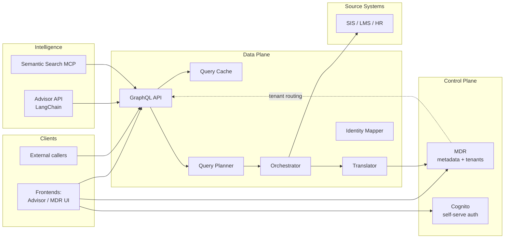

# Architecture

This is the **landing page** for understanding how LIF Core fits together. For the deep dive, see [`docs/overview/services-overview.md`](docs/overview/services-overview.md).

## What LIF Core is

LIF Core (Learner Information Framework) is a modular monorepo that aggregates learner data from multiple source systems (SIS, LMS, HR, etc.) into a standardized, queryable data model. It's not a product; it's a set of composable building blocks that organizations assemble into their own learner-data workflows.

The repository ships a working reference deployment (Docker Compose for local; AWS CloudFormation for dev/demo), but the architecture is designed so each service can be deployed, scaled, or replaced independently.

## Repository layout

LIF Core follows the [Polylith](https://polylith.gitbook.io/) architecture. Three concepts, in one sentence each:

- **`components/lif/`** — Reusable Python modules. Pure logic, no I/O, no deployment code. The interface is the public Python API.
- **`bases/lif/`** — Deployment wrappers (FastAPI apps, MCP servers, etc.) that compose components into runnable shapes.
- **`projects/`** — Executable applications. Each project's `pyproject.toml` lists the bases + components it composes; ships a Docker image.

Other directories you'll see:

| Path | What lives there |
|---|---|
| `frontends/` | React/TypeScript UIs (Advisor, MDR) |
| `orchestrators/dagster/` | Data orchestration jobs |
| `deployments/` | Docker Compose environments |
| `cloudformation/` | AWS infrastructure-as-code |
| `sam/` | Database stacks (Flyway-managed Postgres) |
| `reference_data/schemas/` | Source-of-truth LIF schema JSON |
| `docs/` | Design docs, guides, proposals |
| `scripts/` | Operational scripts (releases, key management, etc.) |
| `test/` | Unit/integration tests, mirroring source structure |

## Service map

The reference deployment composes ~15 microservices. The high-level picture:

For each service's responsibility, endpoints, and dependencies, read [`docs/overview/services-overview.md`](docs/overview/services-overview.md) — it has an expanded version of this diagram plus per-service detail.

## Where to look next

Depending on what you're doing:

| Goal | Read |
|---|---|
| Understand a specific service | [`docs/overview/services-overview.md`](docs/overview/services-overview.md), then the service's own `README.md` |
| Add a new data source | [`docs/operations/guides/add-data-source.md`](docs/operations/guides/add-data-source.md) |
| Add a new microservice | [`docs/operations/guides/adding-a-new-microservice.md`](docs/operations/guides/adding-a-new-microservice.md) |
| Understand auth & multi-tenant onboarding | [`docs/design/cross-cutting/self-serve-tenant-auth.md`](docs/design/cross-cutting/self-serve-tenant-auth.md) |
| Understand LIF's data model conventions | [`docs/specs/data-model-rules.md`](docs/specs/data-model-rules.md) |
| Promote dev → demo | [`docs/operations/guides/demo-environment-update.md`](docs/operations/guides/demo-environment-update.md) |
| Get an AI agent up to speed on this repo | [`CLAUDE.md`](CLAUDE.md) (dense; designed for context-loading, not human reading) |
| Plan ongoing work | [`docs/proposals/`](docs/proposals/) |

## Conventions worth knowing upfront

- **Schema-per-tenant Postgres isolation.** Each customer's data lives in its own `tenant_<group>` schema, populated by cloning the `public` schema via the `clone_lif_schema()` Flyway-installed function. The auth middleware sets `search_path` per request based on the caller's Cognito group claim. See the self-serve auth doc for the full story.
- **PascalCase entities, camelCase scalars.** The data model uses casing to distinguish containers from values. Required by readers (translator, GraphQL filters, config-fragment paths), not by tooling. See [`docs/specs/data-model-rules.md`](docs/specs/data-model-rules.md).
- **Docker wheel installs from PyPI, not `uv.lock`.** A dependency added to the root `pyproject.toml` will not appear in a project's Docker image unless it's also listed in that project's `pyproject.toml`. This has caused production breakage; the new-microservice guide and CLAUDE.md both flag it.
- **Pre-commit hooks are the de facto CI.** No automated PR checks run on feature branches (workflows are deploy-only, triggered on push-to-main). Local `uv run pre-commit run --all-files` is the gate.
