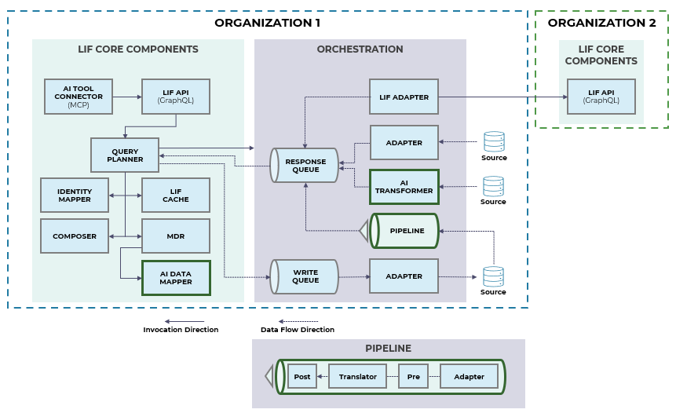
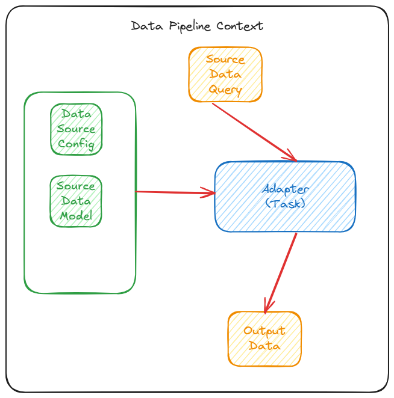
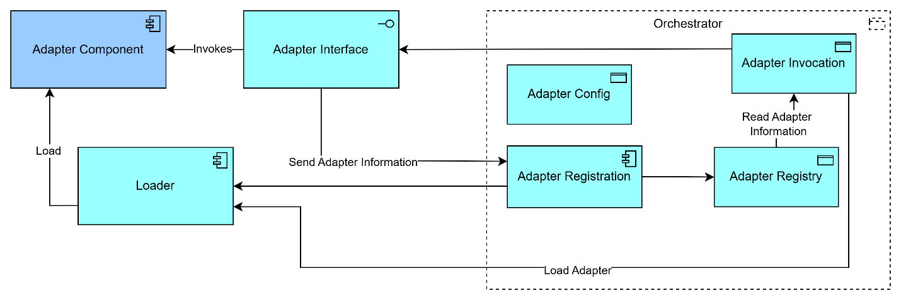
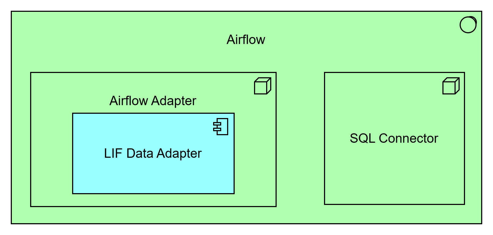
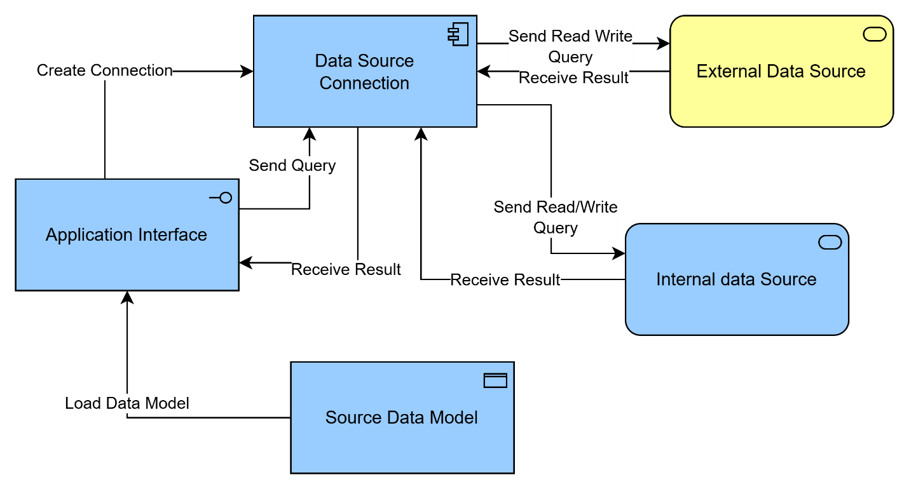
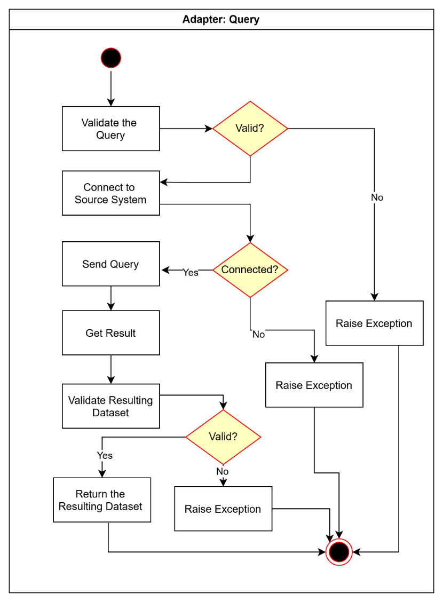
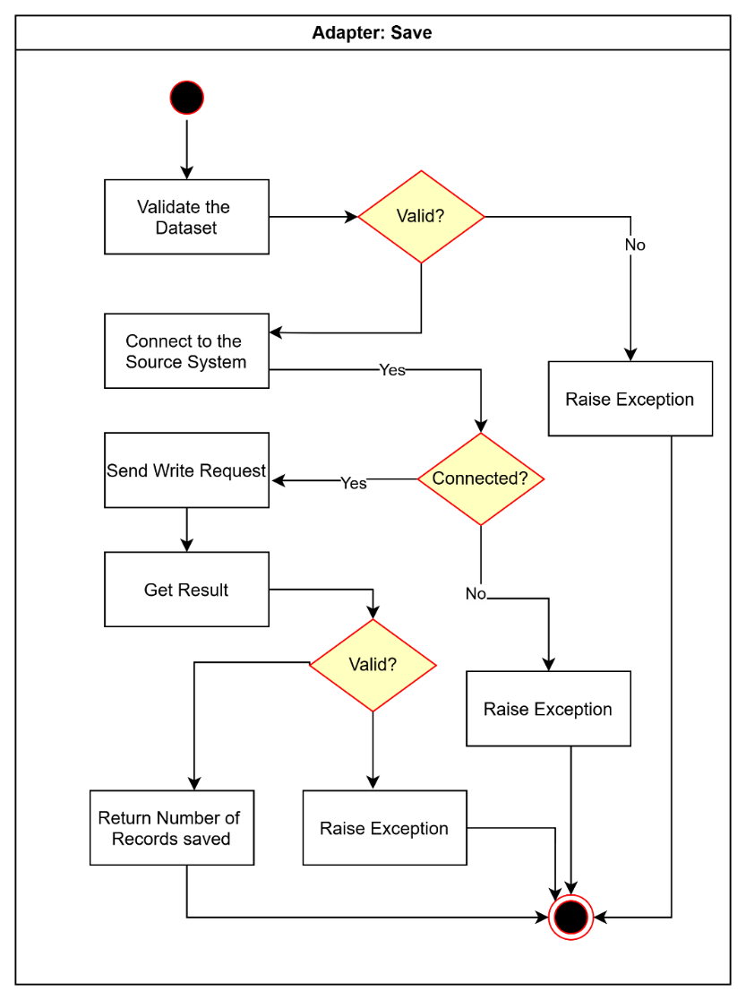

# LIF Adapters and Adapter Framework

Version 1.0.0

**Table of Contents**

[Introduction](#introduction)

&nbsp;&nbsp;&nbsp;&nbsp;&nbsp;&nbsp;[Overview](#overview)

&nbsp;&nbsp;&nbsp;&nbsp;&nbsp;&nbsp;[Motivation](#motivation)

&nbsp;&nbsp;&nbsp;&nbsp;&nbsp;&nbsp;[Key Concepts](#key-concepts)

&nbsp;&nbsp;&nbsp;&nbsp;&nbsp;&nbsp;&nbsp;&nbsp;&nbsp;&nbsp;&nbsp;&nbsp;[Adapter](#adapter)

&nbsp;&nbsp;&nbsp;&nbsp;&nbsp;&nbsp;&nbsp;&nbsp;&nbsp;&nbsp;&nbsp;&nbsp;[LIF Adapter Framework](#lif-adapter-framework)

[Design Proposal](#design-proposal)

&nbsp;&nbsp;&nbsp;&nbsp;&nbsp;&nbsp;[Pipeline Implementation](#pipeline-implementation)

&nbsp;&nbsp;&nbsp;&nbsp;&nbsp;&nbsp;[Requirements](#requirements)

&nbsp;&nbsp;&nbsp;&nbsp;&nbsp;&nbsp;[Interaction with Other LIF Components](#interaction-with-other-lif-components)

&nbsp;&nbsp;&nbsp;&nbsp;&nbsp;&nbsp;[Design Assumptions](#design-assumptions)

&nbsp;&nbsp;&nbsp;&nbsp;&nbsp;&nbsp;&nbsp;&nbsp;&nbsp;&nbsp;&nbsp;&nbsp;[LIF Adapter Framework](#lif-adapter-framework-1)

&nbsp;&nbsp;&nbsp;&nbsp;&nbsp;&nbsp;&nbsp;&nbsp;&nbsp;&nbsp;&nbsp;&nbsp;[Adapter Component](#adapter-component)

&nbsp;&nbsp;&nbsp;&nbsp;&nbsp;&nbsp;[Design Requirements](#design-requirements)

&nbsp;&nbsp;&nbsp;&nbsp;&nbsp;&nbsp;&nbsp;&nbsp;&nbsp;&nbsp;&nbsp;&nbsp;[Performance](#performance)

&nbsp;&nbsp;&nbsp;&nbsp;&nbsp;&nbsp;&nbsp;&nbsp;&nbsp;&nbsp;&nbsp;&nbsp;[Concurrency](#concurrency)

&nbsp;&nbsp;&nbsp;&nbsp;&nbsp;&nbsp;&nbsp;&nbsp;&nbsp;&nbsp;&nbsp;&nbsp;[Task model](#task-model)

&nbsp;&nbsp;&nbsp;&nbsp;&nbsp;&nbsp;&nbsp;&nbsp;&nbsp;&nbsp;&nbsp;&nbsp;[Plug-and-play](#plug-and-play)

&nbsp;&nbsp;&nbsp;&nbsp;&nbsp;&nbsp;[High Level Design](#high-level-design)

&nbsp;&nbsp;&nbsp;&nbsp;&nbsp;&nbsp;&nbsp;&nbsp;&nbsp;&nbsp;&nbsp;&nbsp;[LIF Adapter Framework Design](#lif-adapter-framework-design)

&nbsp;&nbsp;&nbsp;&nbsp;&nbsp;&nbsp;&nbsp;&nbsp;&nbsp;&nbsp;&nbsp;&nbsp;[Adapter Design](#adapter-design)

&nbsp;&nbsp;&nbsp;&nbsp;&nbsp;&nbsp;&nbsp;&nbsp;&nbsp;&nbsp;&nbsp;&nbsp;[Single LIF Adapter for All LIF-Compliant Partner Organizations](#single-lif-adapter-for-all-lif-compliant-partner-organizations)

&nbsp;&nbsp;&nbsp;&nbsp;&nbsp;&nbsp;&nbsp;&nbsp;&nbsp;&nbsp;&nbsp;&nbsp;[Responsibilities](#responsibilities)

&nbsp;&nbsp;&nbsp;&nbsp;&nbsp;&nbsp;&nbsp;&nbsp;&nbsp;&nbsp;&nbsp;&nbsp;[Interface](#interface)

&nbsp;&nbsp;&nbsp;&nbsp;&nbsp;&nbsp;[Workflow Models](#workflow-models)

&nbsp;&nbsp;&nbsp;&nbsp;&nbsp;&nbsp;&nbsp;&nbsp;&nbsp;&nbsp;&nbsp;&nbsp;[Serving Query Requests](#serving-query-requests)

&nbsp;&nbsp;&nbsp;&nbsp;&nbsp;&nbsp;&nbsp;&nbsp;&nbsp;&nbsp;&nbsp;&nbsp;[Serving Save Requests](#serving-save-requests)

&nbsp;&nbsp;&nbsp;&nbsp;&nbsp;&nbsp;[Adapter Configuration](#adapter-configuration)

&nbsp;&nbsp;&nbsp;&nbsp;&nbsp;&nbsp;[Dependencies](#dependencies)

&nbsp;&nbsp;&nbsp;&nbsp;&nbsp;&nbsp;[Exceptions and Errors](#exceptions-and-errors)

&nbsp;&nbsp;&nbsp;&nbsp;&nbsp;&nbsp;&nbsp;&nbsp;&nbsp;&nbsp;&nbsp;&nbsp;[Data validation exception](#data-validation-exception)

&nbsp;&nbsp;&nbsp;&nbsp;&nbsp;&nbsp;&nbsp;&nbsp;&nbsp;&nbsp;&nbsp;&nbsp;[Data source connection exception](#data-source-connection-exception)

&nbsp;&nbsp;&nbsp;&nbsp;&nbsp;&nbsp;&nbsp;&nbsp;&nbsp;&nbsp;&nbsp;&nbsp;[Adapter not found exception](#adapter-not-found-exception)

&nbsp;&nbsp;&nbsp;&nbsp;&nbsp;&nbsp;&nbsp;&nbsp;&nbsp;&nbsp;&nbsp;&nbsp;[Adapter load failed exception](#adapter-load-failed-exception)

&nbsp;&nbsp;&nbsp;&nbsp;&nbsp;&nbsp;&nbsp;&nbsp;&nbsp;&nbsp;&nbsp;&nbsp;[Datasource not available exception](#datasource-not-available-exception)

&nbsp;&nbsp;&nbsp;&nbsp;&nbsp;&nbsp;&nbsp;&nbsp;&nbsp;&nbsp;&nbsp;&nbsp;[Adapter initialization exception](#adapter-initialization-exception)

&nbsp;&nbsp;&nbsp;&nbsp;&nbsp;&nbsp;&nbsp;&nbsp;&nbsp;&nbsp;&nbsp;&nbsp;[Data load exception](#data-load-exception)

&nbsp;&nbsp;&nbsp;&nbsp;&nbsp;&nbsp;[Example Usage](#example-usage)

[Detailed Design](#detailed-design)

&nbsp;&nbsp;&nbsp;&nbsp;&nbsp;&nbsp;[Implementation Model](#implementation-model)

&nbsp;&nbsp;&nbsp;&nbsp;&nbsp;&nbsp;[Tools and Technologies](#tools-and-technologies)

&nbsp;&nbsp;&nbsp;&nbsp;&nbsp;&nbsp;[Implementation Requirements](#implementation-requirements)

&nbsp;&nbsp;&nbsp;&nbsp;&nbsp;&nbsp;&nbsp;&nbsp;&nbsp;&nbsp;&nbsp;&nbsp;[Data Storage](#data-storage)

&nbsp;&nbsp;&nbsp;&nbsp;&nbsp;&nbsp;&nbsp;&nbsp;&nbsp;&nbsp;&nbsp;&nbsp;[State](#state)

&nbsp;&nbsp;&nbsp;&nbsp;&nbsp;&nbsp;&nbsp;&nbsp;&nbsp;&nbsp;&nbsp;&nbsp;[Concurrency](#concurrency-1)

&nbsp;&nbsp;&nbsp;&nbsp;&nbsp;&nbsp;&nbsp;&nbsp;&nbsp;&nbsp;&nbsp;&nbsp;[Sync/Async](#syncasync)

&nbsp;&nbsp;&nbsp;&nbsp;&nbsp;&nbsp;&nbsp;&nbsp;&nbsp;&nbsp;&nbsp;&nbsp;[External Services](#external-services)

[Deployment Design](#deployment-design)

&nbsp;&nbsp;&nbsp;&nbsp;&nbsp;&nbsp;[Deployment Environment](#deployment-environment)

&nbsp;&nbsp;&nbsp;&nbsp;&nbsp;&nbsp;[Deployment Model](#deployment-model)

&nbsp;&nbsp;&nbsp;&nbsp;&nbsp;&nbsp;[Deployment Requirements](#deployment-requirements)

&nbsp;&nbsp;&nbsp;&nbsp;&nbsp;&nbsp;[Dependencies](#dependencies-1)

# Introduction

## Overview

Each **Adapter** in a LIF implementation provides an interface by which the user can access and update their data as requested from an internal or external source data system. **Adapters** query source data systems and return requested learner data in a LIF-compliant data format or in a source data format defined in the **MDR**. **Adapters** also save information provided by a user to update their respective data in the source data systems. With its ability transfer learner's data between data source systems and a LIF system, **Adapters** connect LIF implementations to a wide array of source data systems, including proprietary systems, to support different data storage mechanisms and data models.

In a LIF implementation, an **Adapter** serves as a standardized interface through which users can access or update their data from both internal and external source data systems. Adapters are responsible for querying these systems and returning learner data either in a LIF-compliant format or in a source-specific format as defined in the **Metadata Registry (MDR).** They also support data write-back operations, enabling users to update records in the original source systems.

By facilitating the bidirectional transfer of learner data between source systems and a LIF system, **Adapters** play a crucial role in bridging diverse data ecosystems; including proprietary platforms accommodating various data storage mechanisms and models. Depending on the complexity of a user's data needs and the number of source systems involved, a LIF implementation may utilize one or more **Adapters**, either as standalone components or within a **Data Pipeline**.

These **Adapters** are invoked in a workflow managed by **Orchestrator** which intelligently invokes the required **Adapters** and/or **Data Pipelines** to address the data requirements of a LIF system. The design principles guiding the development of **Adapters** here underpin the broader *LIF Adapter Framework*, which provides a foundational structure for building and integrating Adapters across LIF implementations.

The *LIF Adapter Framework* offers partner organizations a robust set of reusable and extensible components for creating **Adapters** tailored to their unique data systems and use cases. This modular framework supports interoperability by enabling organizations to expose their data to other LIF-compliant organizations in a consistent, manageable way. Over time, the framework is expected to become a key enabler for collaboration within the LIF ecosystem, empowering organizations to contribute and share **Adapters** that expand LIF's reach and applicability across diverse data environments.

While this overview outlines the role of **Adapters** within LIF implementations, the remainder of this design document focuses on the detailed technical requirements and design patterns for building **Adapters** including those that facilitate communication between two LIF systems in alignment with the principles espoused by the *LIF Adapter Framework*.

## Motivation

Any LIF implementation must be capable of accessing and updating learner data across one or more source data systems to fulfill the requirements of incoming LIF queries. These systems may reside within an organization's internal infrastructure or exist externally managed by third parties or external partners.

Source systems can differ significantly in how they manage and expose data, including:

-   Traditional relational databases (RDBMS)

-   Cloud-based storage services

-   Enterprise platforms that expose proprietary data models via APIs

Without a standardized mechanism for interpreting and transforming these diverse data formats, many source systems would return data in non-LIF-compliant or proprietary schemas, preventing seamless integration.

The *LIF Adapter Framework* addresses this challenge by providing a consistent and extensible approach for integrating disparate source systems. It enables organizations to:

-   Build, reuse, and share Adapters using a standardized set of
    interfaces and libraries

-   Translate data from native formats into a LIF-compliant structure

-   Facilitate both **intra-organizational** and **inter-organizational** data exchange

By expanding the range of supported data source types and models, the framework significantly increases the **connectivity surface area** of any LIF implementation. Moreover, it empowers partner organizations to expose their systems to the broader LIF ecosystem; either privately or publicly contributing to a more interoperable and collaborative data exchange landscape.

## Key Concepts

#### Adapter 

**Adapter** enables a LIF system to connect to a data source system allowing for querying and updating different data sources as required to serve user requests. **Adapters** used within a LIF system fall into the following three categories based on whether the respective data source system is internal or external and whether the output data model is source-specific or LIF-compliant:

1.  **Source Data Adapter:** These adapters allow access to a specific source data system and return data aligned to the source data model. A LIF system usually requires a Translator to transform this source data model into a supported LIF data model to make use of the data returned by these adapters.

2.  **LIF Data Adapter:** These adapters enable LIF system to query a source data system but return LIF-compliant data model. These adapters have built in translation capability to produce LIF data models and can be invoked independently to fetch data from source data systems.

3.  **LIF API Adapter:** These adapters let a LIF system access another LIF system via their LIF API to fetch an LIF-compliant data model from external systems.

#### LIF Adapter Framework

The **LIF Adapter Framework** enables data source organizations to develop and register Adapters by adhering to a standardized interface contract. Once built, these Adapters can be dynamically registered and configured, allowing them to seamlessly integrate into the broader LIF ecosystem.

This framework introduces several key capabilities that enhance flexibility, scalability, and maintainability across implementations:

-   **Support for Diverse Adapter Implementations:** Organizations can implement Adapters using a wide range of technologies, languages, or architectures, as long as they conform to the defined interface standards.

-   **Separation of Concerns:** The framework decouples data source organizations (which provide the Adapters) from client organizations (which consume the data), promoting clean boundaries and independent system evolution.

-   **Delegated Adapter Ownership:** Responsibility for developing and maintaining Adapters is delegated to the respective data source organizations, ensuring that Adapter logic remains aligned with the source system\'s structure and updates.

-   **Plug-and-Play Adapter Management:** Adapters can be added, removed, or replaced without requiring changes to the core LIF implementation. This modularity ensures minimal disruption and simplifies maintenance.

-   **Dynamic Adapter Discovery and Invocation:** Through integration with the **Orchestrator**, the framework supports dynamic discovery and execution of the appropriate Adapter based on runtime context, data requirements, or source system metadata.

Together, these features make the LIF Adapter Framework a robust and scalable foundation for enabling secure, efficient, and standardized data exchange across heterogeneous systems.

# Design Proposal

This design document proposes the development of the *LIF Adapter Framework*, a foundational architecture for building and managing **Adapters**. The framework aims to simplify the creation of multiple, customizable **Adapters** by providing a standardized interface and runtime support for dynamic loading and invocation. This allows client organizations to utilize **Adapters** without needing to understand or manage their underlying implementations.

An Adapter is triggered as part of the data read or write workflow when the **Orchestrator**, guided by the **Query Planner**, initiates a request to retrieve or update data from/to a specified data source system. The **Adapter** is responsible for executing this request using a source-specific query.

The Adapter lifecycle proceeds as follows:

1.  **Initialization**: The Adapter is initialized with the necessary **data source configuration** and **source data model**. This includes connection parameters, authentication details, and schema definitions required to interface with the target system.

2.  **Execution**: Once initialized, the Adapter receives a **source data query** from the Orchestrator or pipeline. It establishes a connection to the source system using the provided configuration, executes the query, and retrieves the matching data set.

3.  **Data Handoff**: The Adapter returns the retrieved data to the **host data pipeline**, which then continues downstream processing such as transformation, mapping to a LIF-compliant format, and integration with the broader LIF system.

This architecture ensures that Adapters are modular, reusable, and can be integrated seamlessly into different LIF implementations. The use of configuration-driven initialization and runtime invocation allows for flexibility, scalability, and maintainability across diverse data source environments.

Adapters can be implemented in multiple configurations, depending on the integration context and data exchange requirements. The four primary implementation scenarios are as follows:

1.  **Standalone Adapter:** A self-contained component responsible solely for retrieving data from a non-LIF source data system. This Adapter performs direct data access without being coupled to translation, transformation, or any pre/post-processing logic. It is ideal for lightweight or read-only integrations where raw source data is sufficient.

2.  **Pipeline-Integrated Adapter:** An Adapter implemented as an atomic task within a larger **Data Pipeline**. In this scenario, the Adapter retrieves data from a non-LIF source system and passes it along to other tasks within the pipeline for translation, enrichment, validation, or other processing steps. This pattern is suited for more complex workflows requiring data normalization or mapping to LIF-compliant formats.

3.  **LIF-to-LIF Adapter:** A specialized Adapter that facilitates integration between the implementing organization's LIF system and one or more partner organizations\' LIF implementations. It handles bidirectional communication using LIF-compliant schemas and APIs, supporting scenarios such as federated data sharing, cross-organization queries, or distributed learner data management.

4.  **AI Write Adapter:** A standalone component that takes data generated or enriched by an AI tool and writes it back into the implementing organization's data store via the LIF system. This Adapter enables integration with AI-driven systems ensuring that insights or content generated by such tools are persistently stored within the organization\'s source systems.

Each of these Adapter types leverages the core capabilities of the *LIF Adapter Framework* such as configuration-driven initialization, dynamic discovery, and standardized interfaces while offering flexibility to support diverse architectural patterns and deployment environments.



*Image 1: High-level visualization of the different implementation scenarios for **Adapters** within the greater LIF system*

#### Pipeline Implementation

An **Adapter** can operate in one of two modes: as a **standalone component**, or as a **task within a Data Pipeline**. In the latter case, the Adapter participates in a coordinated workflow managed by an **Orchestrator**, which executes a sequence of tasks as part of a defined pipeline. A typical Data Pipeline consists of the following three tasks:

| Step | Task | Component |
|---|---|---|  
| 1 | Translate a LIF data query to a source data query   | Translator |  
| 2 | Fetch data from a source system or organization | Adapter |
| 3 | Translate the source data set to the LIF data set  | Translator |

The data fetch task is performed by the **Adapter,** while the translation tasks are done by a **Translator**. The Adapter is responsible for:

-   Establishing a connection with the source data system using the provided configuration.

-   Executing the source data query as directed by the Orchestrator.

-   Returning data that conforms to the expected source data model thereby enabling downstream translation and processing.

Some data pipelines may also include **pre-** and **post-processor** tasks to address any conditional filter and transformation requirements, such as the removal of PII or PHI.



*Image 2: Simple diagram to demonstrate how the Adapter component uses data source config and source data model within the data pipeline context to retrieve requested data as specified in the query*

### Requirements

**Adapters** have the following specific requirements:

1.  Load data from a source data system as specified in the source data query and compliant with the specified target data model.

2.  Save specific learner data to a target data source system in compliance with the respective source data model.

**Adapters** may return the data in:

1.  Proprietary source data format,

2.  A LIF-compliant data format with proprietary extensions and constraints, or

3.  LIF data format used by the current LIF system.

## Interaction with Other LIF Components

The **Adapter** interacts with:

1.  The host data pipeline (the **Pipeline**) that invokes it for performing a data fetch or data write task when it runs and receives the return output (only when as a part of a **Pipeline**)

2.  The **Orchestrator**, which invokes it directly for data tasks when it runs independently without being part of any data pipeline and receives the return output

3.  The external or internal data source system to which it connects for reading and writing requested data.

## Design Assumptions 

### LIF Adapter Framework

1.  The framework provides an explicit interface and/or an abstract class for implementing **Adapter** functions.

2.  The framework provides essential libraries supporting foundational capabilities such as data source connections, **Adapter** registration, **Adapter** lookup, **Adapter** loading, data model validations, and data pre- and post-processing.

3.  The framework loads **Adapters** lazily to optimize memory consumption, ensuring better performance.

4.  The framework treats **Adapter** as a black box, invoking it via standard functions available in the interface without having to know about the internal implementation of the **Adapter.**

5.  Using this framework, organizations should be able to build diverse types of **Adapters** without impacting the nature and behavior of their invocations.

### Adapter Component

1.  The component is transient and does not maintain any state.

2.  The component may directly interact with an external resource independently or in a **Pipeline** context.

3.  The component can run as a task in a **Pipeline** or run as a standalone job as orchestrated by a standard orchestration framework (e.g., Apache Airflow, AWS Glue, or Azure Data Factory).

4.  The component returns its output to the pipeline context that may pipe it to the next task in the sequence or push that to the corresponding response queue if there is no task after it.

5.  The component presumes that the source data models provided to it are correct and complete for processing the query in the source data system.

6.  The component logs its run, and the log detail can be used to debug and assess its performance.

7.  Some **Adapters** may include translation functions to abstract proprietary source data formats and return data in more standardized formats like LIF.

8.  Adapters never throw out any unchecked or unexpected errors, always raising exceptions as published in the interface.

## Design Requirements

### Performance

The component should provide consistent performance irrespective of the size and complexity of the data structure it is translating.

### Concurrency

Concurrent data fetch requirements are addressed by the **Pipeline** and **Adapter**. At any point in time, it processes one and only one data fetch request.

### Task model

The component is modeled as a task that represents a node in a DAG (Directed Acyclic Graph). Modeling the component as a task abstracts its implementation and allows for seamless invocation by the data pipeline.

### Plug-and-play 

The component can be integrated with different task orchestration frameworks as plug-and-play without requiring any significant redesign to their implementation, though some orchestration frameworks might require a wrapper depending on their specific needs.

## High Level Design 

### LIF Adapter Framework Design

The proposed design for the *LIF Adapter Framework* adopts a **Service Provider Interface (SPI)** pattern to decouple the specification of **Adapter** behavior from its concrete implementations. This design enables clear separation of concerns by enforcing a standardized component interface, allowing different organizations or teams to build, maintain, and deploy Adapters independently while still ensuring compatibility and seamless data exchange within the broader LIF ecosystem.



*Image 3: High-level diagram of LIF Adapter Framework design*

At the core of this framework is a well-defined Adapter interface
contract, which must be implemented by all LIF Adapters. This
standardization ensures consistency in how **Adapters** connect to
source data systems, execute queries, and return learner data aligned to the expected source data model.

However, when integrating with an **Orchestrator** such as Apache Airflow, the standard LIF Adapter must be wrapped with an
orchestration-specific interface. This wrapper or integration hook
allows the **Orchestrator** to invoke any Adapter seamlessly within a workflow or data pipeline.

For example, to invoke a LIF Adapter from Airflow, the Adapter must be wrapped with an **Airflow-compatible interface** such as a custom **Airflow Operator** or **Hook**. This integration layer acts as a bridge between the generic LIF Adapter and the orchestration platform, handling invocation, configuration injection, and result management. These orchestration adapters can be:

-   Statistically implemented, with hard-coded bindings to specific LIF Adapter instances, or;

-   Dynamically configured, where the Orchestrator loads and executes **Adapters** at runtime based on external configuration or metadata.

A LIF Data Adapter using Airflow SQL Data Connector wrapped under Airflow Data Adapter can be represented by the following diagram.



Image 4: A representation of LIF Data Model being used in an Orchestrator (Airflow)

The *LIF Adapter Framework* contains the following key components:

1.  **Adapter interface:** This represents the specification for an **Adapter** component, but does not include its implementation. Any **Adapter** must provide implementations for the functions published in this interface.

2.  **Adapter component:** This is the concrete implementation of an Adapter that is built by a developer by implementing the Adapter interface.

3.  **Loader:** This is a class loader module that loads a given **Adapter** based on its package and main module class path.

There are some other components that play key roles in the lifecycle of an Adapter, including:

1.  **Adapter config:** This is a configuration file for an **Adapter**, usually maintained in a JSON document that helps locate a specific module for a given **Adapter** to appropriately initialize it. One **Adapter** configuration file may contain entries for multiple **Adapters**.

2.  **Adapter registry:** This is a data table within an orchestrator that maintains all the adapters successfully loaded.

3.  **Adapter registration:** This function from Orchestrator is responsible for registering an Adapter specified in the Adapter config.

4.  **Adapter invocation:** This function from Orchestrator invokes a registered Adapter to perform fetch data tasks.

Besides providing foundational capabilities to build **Adapters** the *LIF Adapter Framework* together with an Orchestrator provides following functions to manage Adapters:

1.  Register/De-register an **Adapter**

The **Adapter** framework aids in registering an **Adapter** to an adapter registry maintained by the **Orchestrator**. Registering an **Adapter** in the **Orchestrator** makes it available for the pipelines spun by the **Orchestrator**. The adapter registry maintains the configuration for an Adapter such as package and the main module that is required to load it successfully. A registered Adapter can be de-registered, in which case the adapter is removed from the adapter registry and is no longer available to the Orchestrator.

Please note that the *LIF Adapter Framework* will throw an "Invalid Adapter Configuration" error if it receives package and main module that is not available in the deployed package

2.  Invoke an **Adapter**

The Adapter framework can also be used by an Orchestrator to invoke an Adapter available in the Adapter Registry.

### Adapter Design

The proposed design envisions an **Adapter** as a serverless and stateless function that operates in a transient runtime environment.



*Image 4: High-level diagram of **Adapter** design*

The **Adapter** contains two key modules:

1.  **Data Source Connection**

This module provides connectivity to diverse types of data sources such as RDBMS, document databases, graph databases, and other sources supporting ODBC and JDBC connections.

The Adapter leverages data source connectivity of a to-be-determined orchestration tool such as Apache Airflow, AWS Glue, or Azure Data Factory. Considering this, the module provides an interface for the **Adapter** to configure and use the data source providers available in the selected orchestrator tool.

Though in most cases, the data source providers available with the standard orchestrator tools will meet the data source connectivity requirements of the LIF system, this module supports creating a custom data source connection if so required.

2.  **Source Data Model**

This module enables the **Adapter** to communicate with the data source it is connected to using the **Data Source Connection** module. The **Source Data Model** specifies the data structure for the data that can be read from and written to a data source.

An **Adapter** provided by an external organization must have an interface to connect to a specific data source and a data model that the Adapter uses to communicate with the data source. Depending on its implementation, an **Adapter** [may return to a data set aligned to the LIF model of the current LIF system, a LIF compliant model with custom extensions and constraints, or a proprietary data model.]{.underline} If an **Adapter** returns a data set that is not completely aligned with the LIF model of the current LIF system, a **Translator** is required to translate this data set to the LIF model of the target LIF system.

The **Adapter** employs several patterns to fetch the source data set from corresponding data source system in a data format specified by the source data model. These patterns are:

-   **Adapter:** Allows incompatible interfaces to work together by
    converting source interface into target interface.

-   **Data access object:** Provides an abstract interface to data source system separating source-specific data access logic from data use logic.

Once initialized and invoked by the host data pipeline, the **Adapter** runs as a self-contained component without having to interact with any other LIF component while performing the data operations with the source data systems. This is a light-weight component that does not maintain any information about a run. However, it depends on the corresponding data source system to complete its run.

### Single LIF Adapter for All LIF-Compliant Partner Organizations

For release 1, we envision a single **LIF Adapter** that can interact with all LIF-compliant partner organizations that provide data for the *LIF data model* supported by this organization. This **Adapter** has the necessary intelligence to identify the list of appropriate data source organizations for a given *LIF branch* as requested in the *LIF query*. It can be initialized with data source configuration for all relevant data sources for partner organizations. This reduces the dependency of **Query Planner** and/or **MDR** to get source metadata information for selecting and invoking appropriate adapters to fetch data required to serve a given *LIF query.*

### Responsibilities

The **Adapter** component must support querying the data source for full or part of learner data to save new learner information. The **Adapter** will apply the provided source data models to validate the data fetched from the corresponding data source system.

The component design includes two key functions:

1.  Query specific learner data from internal or external data source system
2.  Add new or update existing learner data to internal data source system

### Interface

The **Adapter** supports the following methods:

1.  Initialize - An **Adapter** can be initialized with source data model and data source connection. Some adapters may encapsulate both these details and may not need to be explicitly initialized. Initialization parameters, if required, are provided as valid JSON documents. The component is instantiated with these parameters.

2.  Query - A successfully initialized **Adapter** can be used to fetch data from source systems by calling its query method with an appropriate source query. The component uses data source information to connect to the corresponding data source system. <br><br>It then uses the connection to send a query and receive the result against it. It validates the result with source data model before returning that to the **Pipeline**.

3.  Save - An **Adapter** can be used to save new learner data by calling its save method with a source data set. The component validates the data with the source data model before using the data source connection to write the data to the respective data source system.

## Workflow Models 

A **Pipeline** spins up an **Adapter** component when it comes across a data fetch or data write task in its DAG. The **Adapter** component is initialized with a corresponding source data model and data source connection information.

The **Pipeline** interacts the **Adapter** component with either a source data query or source data set.

### Serving Query Requests

For serving query requests, the **Adapter** validates connects to the corresponding data source and runs the query using the connection to fetch data from the source system.



*Image 5: Workflow map of the Adapter's query process*

### Serving Save Requests

For save requests, the **Adapter** validates the source dataset with source data model and writes the validated dataset to the source data system.



*Image 6: Workflow map of the Adapter's save process*

## Adapter Configuration

The **Adapter** component may use the following three configurations to operate.

1.  **Source Data Model:** A JSON schema document validates the input JSON dataset before starting the transformation.

Sample:
```
[{
"name": "field_name",
"type": "field_data_type"
}]
```

2.  **Data Source:** A JSON document provides required information to connect to a given data source.

Sample:
```
[{

"name": "datasource_name",
"type": "datasource_type",
"params": {

  // Datasource connection parameters

 }

 }\]
```

3.  **Adapter Module:** A JSON document provides information for locating module implementing a given Adapter and parameters to appropriately initialize it.

Sample:
```
[{
"name": "adapter_name",
"package": "full_package_name",
"main_module": "main_module_name",
"params": {

// Parameters to initialize the adapter module

}}]
```
The component validates these key configurations at the setup time, and it fails the setup if any of these are missing, incomplete, or invalid. For some **Adapters** that encapsulate the data source and data model information, we may not need those configuration files explicitly.

## Dependencies

TBD

## Exceptions and Errors

### Data validation exception

This exception occurs when input query or output data do not comply with their corresponding data model.

### Data source connection exception

This exception occurs if there is an error connecting to the data source.

### Adapter not found exception

This exception occurs if there is no entry in the configuration file for an **Adapter** being looked up or invoked.

### Adapter load failed exception

This exception occurs when an **Adapter** module is not properly loaded and initialized due to either incorrect configuration or respective module not available.

### Datasource not available exception

This exception occurs when an adapter cannot connect to a specific data source as configured.

### Adapter initialization exception

This exception occurs when an adapter cannot be initialized successfully and therefore is not available for querying or saving any data.

### Data load exception

This exception occurs when an adapter cannot load requested data successfully from the underlying data source system.

Data save exception

This exception occurs when an adapter cannot save requested data successfully to the underlying data source system.

## Example Usage
```
config = {

"datasource": datasource_config,

"source_model": source_data_model

}

adapter = Adapter(config)

output_data = adapter.query(input_query)

adapter.save(input_data)
```

# Detailed Design

This component is designed to be implemented as a serverless component that can be scaled on demand.

## Implementation Model

This component is implemented as a Python module with an interface providing the two functions to initialize and run translation.

The component uses JSON format for data models, mapping documents, and datasets.

It can use open-source Python frameworks or packages for the required capabilities of schema validation and schema mapping.

## Tools and Technologies

The data models, mapping, and dataset are in JSON format.

The component is implemented using Python.

Appropriate Python packages and solutions such as jsonschema, jsonpath, and glom can be used to maintain and apply data models.

## Implementation Requirements

### Data Storage

This component does not have any data storage requirements.

### State

This component is stateless and does not maintain any information about any run.

### Concurrency

Being a stateless component, it should be able to scale on demand to address multiple concurrent requests.

### Sync/Async

This component operates in sync mode and the client waits for it to return the result before performing any other activity.

### External Services

This component interacts with source data systems internal or external to the current LIF system.

# Deployment Design

## Deployment Environment

The component can be deployed in the cloud using serverless
infrastructure such as AWS Step Function or Azure Function. In an
on-prem deployment environment, the component can be deployed in a docker container running the data pipeline.

## Deployment Model

TBD

## Deployment Requirements

TBD

## Dependencies

TBD
