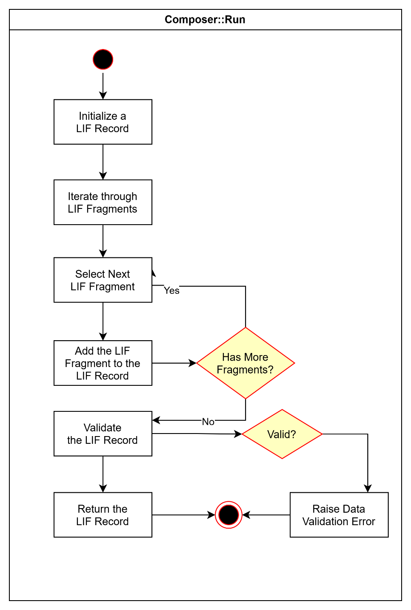
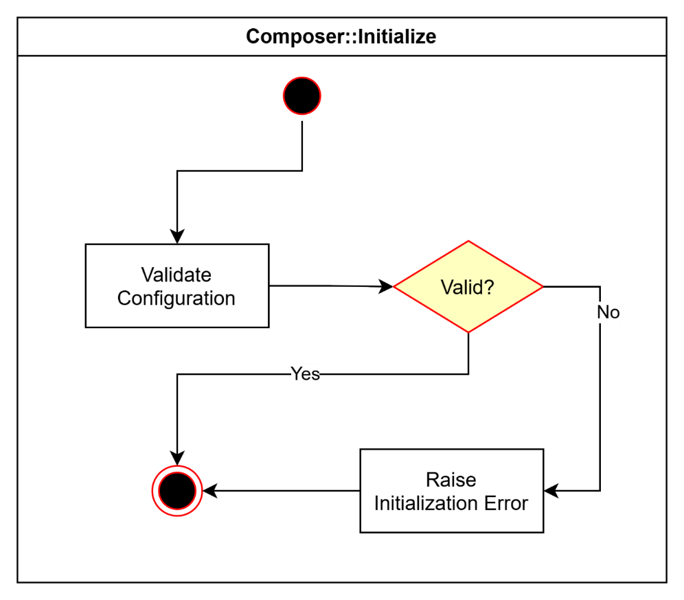
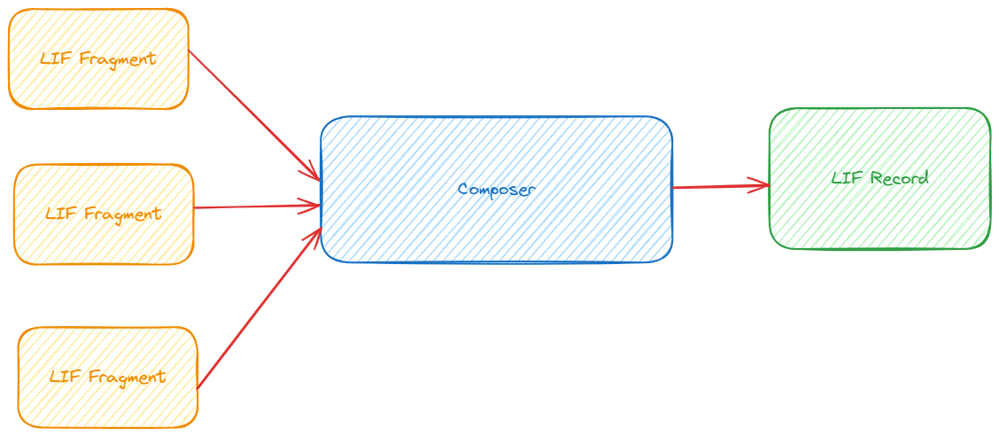

# Composer

Version 1.0.1

**Table of Contents**

[Overview](#overview) 

[Motivation](#motivation)

[Design Proposal](#design-proposal) 

&nbsp;&nbsp;&nbsp;&nbsp;&nbsp;&nbsp;[Key Concept](#key-concept) 

&nbsp;&nbsp;&nbsp;&nbsp;&nbsp;&nbsp;&nbsp;&nbsp;&nbsp;&nbsp;&nbsp;&nbsp;[LIF Record](#LIF-record) 

&nbsp;&nbsp;&nbsp;&nbsp;&nbsp;&nbsp;&nbsp;&nbsp;&nbsp;&nbsp;&nbsp;&nbsp;[LIF Fragment](#LIF-fragment) 

&nbsp;&nbsp;&nbsp;&nbsp;&nbsp;&nbsp;[Interaction with Other LIF Components](#interaction-with-other-lif-components) 

&nbsp;&nbsp;&nbsp;&nbsp;&nbsp;&nbsp;[Design Assumptions](#design-assumptions) 

&nbsp;&nbsp;&nbsp;&nbsp;&nbsp;&nbsp;[Design Requirements](#design-requirements) 

&nbsp;&nbsp;&nbsp;&nbsp;&nbsp;&nbsp;&nbsp;&nbsp;&nbsp;&nbsp;&nbsp;&nbsp;[Performance](#performance) 

&nbsp;&nbsp;&nbsp;&nbsp;&nbsp;&nbsp;&nbsp;&nbsp;&nbsp;&nbsp;&nbsp;&nbsp;[Concurrency](#concurrency) 

&nbsp;&nbsp;&nbsp;&nbsp;&nbsp;&nbsp;&nbsp;&nbsp;&nbsp;&nbsp;&nbsp;&nbsp;[High Availability](#high-availability) 

&nbsp;&nbsp;&nbsp;&nbsp;&nbsp;&nbsp;[High Level Design](#high-level-design) 

&nbsp;&nbsp;&nbsp;&nbsp;&nbsp;&nbsp;&nbsp;&nbsp;&nbsp;&nbsp;&nbsp;&nbsp;[Interface](#interface) 

&nbsp;&nbsp;&nbsp;&nbsp;&nbsp;&nbsp;[Workflow Model](#workflow-model) 

&nbsp;&nbsp;&nbsp;&nbsp;&nbsp;&nbsp;[Configuration](#configuration) 

&nbsp;&nbsp;&nbsp;&nbsp;&nbsp;&nbsp;[Dependencies](#dependencies) 

&nbsp;&nbsp;&nbsp;&nbsp;&nbsp;&nbsp;[Exceptions and Errors](#exceptions-and-errors) 

&nbsp;&nbsp;&nbsp;&nbsp;&nbsp;&nbsp;&nbsp;&nbsp;&nbsp;&nbsp;&nbsp;&nbsp;[LIF record build exception](#LIF-record-build-exception) 

&nbsp;&nbsp;&nbsp;&nbsp;&nbsp;&nbsp;&nbsp;&nbsp;&nbsp;&nbsp;&nbsp;&nbsp;[LIF record validation exception](#LIF-record-validation-exception) 

&nbsp;&nbsp;&nbsp;&nbsp;&nbsp;&nbsp;[Example Usage](#example-usage) [Detailed Design](#detailed-design) 

&nbsp;&nbsp;&nbsp;&nbsp;&nbsp;&nbsp;[Key Implementation Considerations](#key-implementation-considerations) 

&nbsp;&nbsp;&nbsp;&nbsp;&nbsp;&nbsp;&nbsp;&nbsp;&nbsp;&nbsp;&nbsp;&nbsp;[Implementation Design Principles](#implementation-design-principles) 

&nbsp;&nbsp;&nbsp;&nbsp;&nbsp;&nbsp;&nbsp;&nbsp;&nbsp;&nbsp;&nbsp;&nbsp;[Building LIF Record with LIF Fragments](#building-lif-record-with-lif-fragments) 

&nbsp;&nbsp;&nbsp;&nbsp;&nbsp;&nbsp;&nbsp;&nbsp;&nbsp;&nbsp;&nbsp;&nbsp;[Dealing with Array Elements](#dealing-with-array-elements) 

&nbsp;&nbsp;&nbsp;&nbsp;&nbsp;&nbsp;&nbsp;&nbsp;&nbsp;&nbsp;&nbsp;&nbsp;[Other Implementation Considerations](#cross-component-design-considerations) 

&nbsp;&nbsp;&nbsp;&nbsp;&nbsp;&nbsp;[Implementation Model](#implementation-model) 

&nbsp;&nbsp;&nbsp;&nbsp;&nbsp;&nbsp;[Tools and Technologies](#tools-and-technologies) 

&nbsp;&nbsp;&nbsp;&nbsp;&nbsp;&nbsp;[Implementation Requirements](#implementation-requirements) 

&nbsp;&nbsp;&nbsp;&nbsp;&nbsp;&nbsp;&nbsp;&nbsp;&nbsp;&nbsp;&nbsp;&nbsp;[Data Storage](#data-storage) 

&nbsp;&nbsp;&nbsp;&nbsp;&nbsp;&nbsp;&nbsp;&nbsp;&nbsp;&nbsp;&nbsp;&nbsp;[State](#state) 

&nbsp;&nbsp;&nbsp;&nbsp;&nbsp;&nbsp;&nbsp;&nbsp;&nbsp;&nbsp;&nbsp;&nbsp;[Concurrency](#concurrency-1) 

&nbsp;&nbsp;&nbsp;&nbsp;&nbsp;&nbsp;&nbsp;&nbsp;&nbsp;&nbsp;&nbsp;&nbsp;[Sync/Async](#syncasync) 

&nbsp;&nbsp;&nbsp;&nbsp;&nbsp;&nbsp;&nbsp;&nbsp;&nbsp;&nbsp;&nbsp;&nbsp;[External Services](#external-services) 

&nbsp;&nbsp;&nbsp;&nbsp;&nbsp;&nbsp;[Deployment Design](#deployment-design) 

&nbsp;&nbsp;&nbsp;&nbsp;&nbsp;&nbsp;&nbsp;&nbsp;&nbsp;&nbsp;&nbsp;&nbsp;[Deployment Environment](#deployment-environment) 

&nbsp;&nbsp;&nbsp;&nbsp;&nbsp;&nbsp;&nbsp;&nbsp;&nbsp;&nbsp;&nbsp;&nbsp;[Deployment Model](#deployment-model) 

&nbsp;&nbsp;&nbsp;&nbsp;&nbsp;&nbsp;&nbsp;&nbsp;&nbsp;&nbsp;&nbsp;&nbsp;[Deployment Requirements](#deployment-requirements) 

&nbsp;&nbsp;&nbsp;&nbsp;&nbsp;&nbsp;&nbsp;&nbsp;&nbsp;&nbsp;&nbsp;&nbsp;[Dependencies](#dependencies-1)

# Overview

The **Composer** component builds a more comprehensive LIF record with a given set of LIF fragments. It ensures that the **LIF API** receives a holistic LIF record composed of all the LIF fragments returned against a LIF query.

# Motivation

Any user query via the **LIF API** is broken down into one or more source-specific queries depending on the different data source systems required to fulfil the query. These data source systems can be internal to the organization or abstracted by an LIF **API** of the partnering organization. Based on these queries to individual data sources, multiple data pipelines may be triggered to produce a collection of disparate LIF fragments.

These LIF fragments need to be combined into a single holistic LIF record that represents the result of the **LIF API** query. The **LIF** **API** generates a request and receives results without being cognizant of individual source data systems required to provide the relevant data. Similarly, the **Orchestrator** data pipelines, and pipeline components operate on a source-specific query model regardless of how these individual results will serve the **LIF API** query. The **Composer** is the only component that provides a composition service in the Framework.

# Design Proposal

## Key Concept

### LIF Record

A LIF record is a holistic learner information dataset containing all of the parts required to satisfy a given **LIF API** query.

### LIF Fragment

A LIF fragment is a partial learner information dataset containing data for a given part of a holistic LIF record. A LIF fragment corresponds to a given part of the LIF record represented by a semantic path in a hierarchical structure relative to the root of the LIF record. Each LIF fragment contains a LIF fragment path along with the learner information in the LIF fragment. The learner information can be a JSON object or a collection of more than one JSON object. A LIF fragment path can be represented as a JSON Path expression such as `$.Person[?(@.Identifier[?(@.identifier == "person_identifier")])].Contact`

A sample collection of LIF fragments may look like the following:

```
lif_fragments = \[{
"fragment_path": "$.Person[?(@.Identifier[?(@.identifier == "person_identifier")])].Contact",

"fragment": {
#sample json
}
}]
```

The **Composer** component is a standalone component that combines multiple LIF fragments into one LIF record. A LIF record is assembled from a set of fragments each corresponding to a unique fragment path.

The **Composer** is invoked by **LIF Cache, Query Planner,** or **LIF API** to build LIF record with a collection of LIF fragments.



*Image 1: Simple diagram of the composition process in which the Composer turns LIF fragments into a holistic LIF record*

## Interaction with Other LIF Components

This component directly interacts with the **LIF Cache,** **Query Planner,** and **LIF API**. These components can invoke the **Composer** with a set of LIF fragments returned from the data request, and the **Composer** returns a LIF record with all the fragments appropriately consolidated.

## Design Assumptions

1.  The component is transient and does not maintain any state.

2.  The component is highly available and is always ready to respond to any composition request.

3.  The component doesn't interact with any external resources except for the **LIF Cache, Query Planner,** and **LIF API** components that call it for a composition request.

4.  The component runs as an independent function in its own runtime and returns the output LIF record to the calling component.

5.  The component presumes that the LIF fragments provided are correct and can be used to build a valid LIF record by using their respective fragment paths.

6.  The component expects the LIF fragments in JSON format and returns the LIF record in JSON format.

7.  The component currently serves only internal composition requests from the **LIF Cache** and **Query Planner** and doesn't expose its services to any external entities.

8.  The component logs its run, and the log detail can be used to debug and assess its performance.

## Design Requirements

### Performance

The component should provide consistent performance irrespective of the size and complexity of the data structure it is composing.

### Concurrency

The **Composer** component should be able to address concurrent LIF record composition requests.

### High Availability

The component should always be available to serve incoming composition requests irrespective of the number of such requests and results of previous composition runs.

## High Level Design

The proposed design envisions the **Composer** component as a serverless and stateless function that operates in a transient runtime environment.

The **Composer** component implements a Builder pattern to incrementally and iteratively build a LIF record with LIF fragments. Each LIF fragment is represented by a fragment path relative to the root and the respective JSON data. The component may also use the Strategy pattern to allow for different composition approaches if required.

Once initialized and invoked, the **Composer** runs as a self-contained component without having to interact with any other LIF component to perform the composition. This is a light-weight component that does not maintain any information about a run. It also does not depend on any external entity to perform the composition.

The **Composer** component should be able to support composing LIF fragments of any shape into a LIF record.

### Interface

The **Composer** component supports following methods:

1.  **Initialize** - The **Composer** can be initialized with a valid LIF data model and any specific configuration to influence the composition outcome aligning the result to the client\'s expectations. These configurations are passed as valid JSON documents that are used by this component to initialize itself at the time of instantiation.

2.  **Run** - Once initialized, the **Composer** component can be invoked by calling its run method with a collection of LIF fragments. The component builds the target data set by incrementally adding each LIF fragment to the appropriate position specified by the fragment path.
 The LIF fragment path provides an absolute semantic path for a given LIF fragment relative to the root.
 After successfully building the target dataset, it validates that with the appropriate LIF data model before returning that to the calling component.

## Workflow Model

The **Composer** component is spun up when it's invoked by the **LIF Cache, Query Planner** or **LIF API** to build a LIF record from multiple LIF fragments. The **Composer** component may be invoked with a configuration specifying any specific composition instruction, such as rolling up an entity that has all its descendants with no value.



*Image 2: Simple workflow map for the initialization of the LIF Composer*

A successfully initialized **Composer** can then be invoked with a list of LIF fragments to get a corresponding LIF record.



*Image 3: Simple workflow map for the Composer's run process*

The **Composer** iterates through the list of LIF fragments, each containing a fragment path and the corresponding data, and then adds them to the output data structure. Once all the fragments are appropriately added to the output data structure, the resulting dataset is validated for a LIF data model and then returned to the caller component, which can be either the **LIF Cache, Query Planner** or the **LIF API**.

## Configuration

The **Composer** component may use specific configurations to influence the composition outcome. These configurations may include following information to influence the composition outcome:
```
{

"null_data_structure": "rollup\|remove",

"null_data_element": "remove"

}
```
These configurations are provided to the **Composer** component by the calling components including **LIF Cache,** **Query Planner,** and **LIF API**.

## Dependencies

## Exceptions and Errors

### LIF record build exception

This exception occurs when a **Composer** faces unexpected issues while assembling LIF fragments into a LIF record.

### LIF record validation exception

This exception occurs if a composed LIF record does not adhere to the LIF data model provided.

## Example Usage
```
config = {

"null_data_structure": "rollup",
"null_data_element": "remove"
}
composer = Composer(config)
composer.run(lif_fragments)
```
# Detailed Design

This component is designed to be implemented as a serverless component that can be scaled on demand.

## Key Implementation Considerations

### Implementation Design Principles

1.  **Initialization:** The Composer must be initialized with a valid ,LIF data model.

2.  **Addable nodes must be arrays:** All Addable nodes must be of type Array, capable of holding either longitudinal or coexisting values.

3.  **Output conformance:** The Composer always generates a LIF record that strictly conforms to the provided data model, automatically removing any unsupported or extraneous data.

4.  **Append-only behavior:** The Composer only appends input LIF, fragments to the target node's array. It does not update or delete existing data in the LIF record.

5.  **Fragment rooting:** All input LIF fragments must contain fully qualified JSON paths rooted at the Person node to be eligible for composition.

6.  **Fragment format:** Each LIF fragment must be a complete, well-formed JSON object that matches the structure expected for an array element of its target Addable node.

7.  **Path and schema validation:** Each fragment's JSONPath must exactly match the path of an Addable node in the LIF data model. The fragment content must conform to the schema defined for that node.

8.  **Atomic composition:** The Composer processes all LIF fragments in a single operation. If any fragment fails validation or processing, the entire composition is aborted and returns an error.

9.  **Fragment grouping by path:** Composer uses each fragment's JSONPath to identify its target node within the Person record. If multiple fragments share the same path, they are appended to the same node as either longitudinal or coexisting values, depending on the node's configuration.

### Building LIF Record with LIF Fragments

Given a LIF data model and a collection of LIF fragments, the **Composer** follows this strategy to construct a valid LIF record:

1.  **Initialize the target record:** Start with the current LIF record if one exists; otherwise, create a new, empty document.

2.  **Parse fragment paths:** For each LIF fragment, convert its JSONPath to a standard object dot path to locate the target node.

3.  **Validate target node:** Ensure the target node exists in the LIF data model, is marked as Addable, and is defined as an array type.

4.  **Prune and validate fragment:** Remove any extraneous fields from the fragment and validate its structure against the schema defined for the corresponding node in the LIF data model.

5.  **Append fragment to record:** Add the validated fragment data to the identified array in the target LIF record.

6.  **Validate final record:** Once all fragments are processed, validate the assembled LIF record against the full LIF data model to ensure structural and type correctness.

7.  **Return final record:** Output the completed and validated LIF record as a well-formed JSON document.

### Dealing with Array Elements

The **LIF data model** uses arrays to represent two distinct types of data:

1.  **Longitudinal values:** These are single-valued elements tracked over time. At any given moment, only one value is considered active, determined by a specific timestamp field such as effectiveDate.

2.  **Coexisting values:** These represent multi-valued elements where multiple values can exist concurrently without time-based constraints.

When building a LIF record, the **Composer** determines whether a target node accepts **longitudinal** or **coexisting** values based on the data model and the presence of the effectiveDate parameter in the fragment.

The **Composer,** while building an LIF record with collection of LIF fragments, deals with these two arrays as given below.

**Longitudinal arrays**

-   Identifies the array type by detecting the effectiveDate field in the fragment.

-   Validates that the resulting array has **no overlapping time periods**, ensuring a clear temporal sequence.

-   Adds the fragment ensuring that only one value is "current" at any point in time, based on the effectiveDate.

**Coexisting arrays**

-   Recognizes the absence of the effectiveDate field.

-   Validates the structure of the incoming fragment.

-   Adds the fragment to the array directly, with optional logic for **deduplication** or **replacing the full list** when the array is small and flat.

**Important Note**

To replace a specific item in a coexisting array, each array item must have a unique element identifier. This identifier can be either explicitly defined in the data model or automatically added by the system. For coexisting arrays that don't have elements with unique identifiers, individual items cannot be updated directly. In such cases, the entire array must be replaced.

Longitudinal arrays don't need unique identifiers for their elements to be updated. New elements are added with respective effective dates, and a single current value is determined based on the latest effective date.

### Cross-Component Design Considerations

1.  This pattern requires the **MDR** component to provide appropriate indicators enabling **Composer** to identify and appropriately process longitudinal and co-existing arrays.

2.  This pattern greatly simplifies the process of building a valid LIF record and reduces the scope of **LIF Cache** for querying and updating LIF records.

## Implementation Model

This component is implemented as a python module with interface providing the two functions to initialize and run composition. This component module may also be packaged and deployed as a service as required for the targeted functional environment.

## Tools and Technologies

The composition configurations, LIF fragments, and LIF records are in JSON format.

The component is implemented using Python.

## Implementation Requirements

### Data Storage

This component does not have any data storage requirements.

### State

This component is stateless and does not maintain any information about any run.

### Concurrency

Being a stateless component, it should be able to scale on demand to address multiple concurrent requests.

### Sync/Async

This component operates in sync mode, and the client waits for it to return the result before performing any other activity.

### External Services

This component does not call any external services.

# Deployment Design

## Deployment Environment

The component can be deployed in the cloud using serverless infrastructure such as AWS Step Function or Azure Function. In an on-prem deployment environment, the component can be deployed as a dependency along with the LIF API and Query Planner modules.

## Deployment Model

TBD

## Deployment Requirements

TBD

## Dependencies

TBD 
