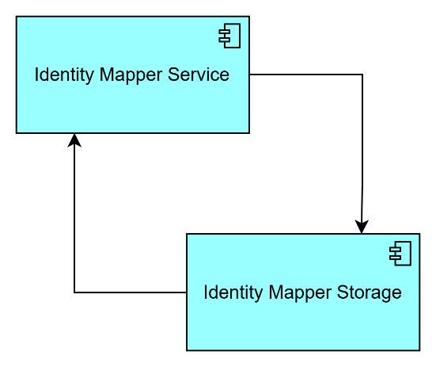
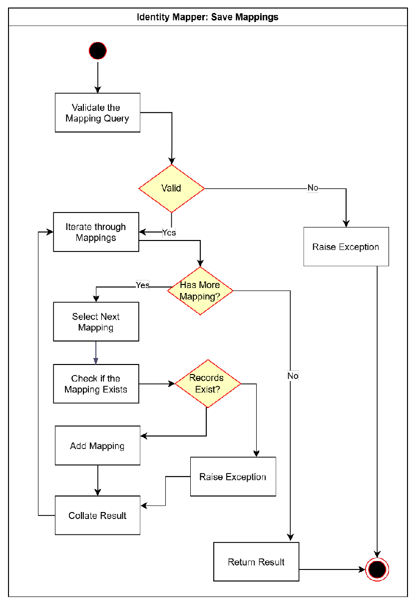
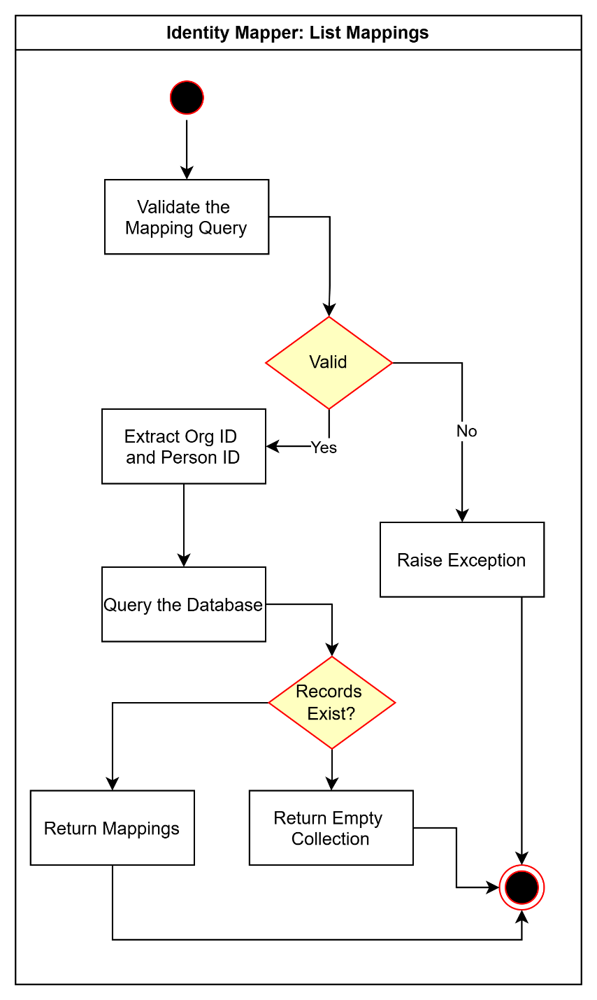
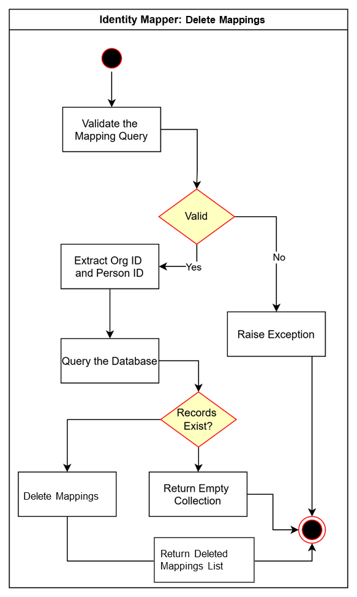

# Identity Mapper

Version 1.0.0

**Table of Contents**

[Overview](#overview)

[Motivation](#motivation)

[Design Proposal](#design-proposal)

&nbsp;&nbsp;&nbsp;&nbsp;&nbsp;&nbsp;[Key Concept](#key-concept)

&nbsp;&nbsp;&nbsp;&nbsp;&nbsp;&nbsp;[Functional Requirements](#functional-requirements)

&nbsp;&nbsp;&nbsp;&nbsp;&nbsp;&nbsp;[Interaction with Other LIF Components](#interaction-with-other-lif-components)

&nbsp;&nbsp;&nbsp;&nbsp;&nbsp;&nbsp;[Design Assumptions](#design-assumptions)

&nbsp;&nbsp;&nbsp;&nbsp;&nbsp;&nbsp;[Design Requirements](#design-requirements)

&nbsp;&nbsp;&nbsp;&nbsp;&nbsp;&nbsp;&nbsp;&nbsp;&nbsp;&nbsp;&nbsp;&nbsp;[Performance](#performance)

&nbsp;&nbsp;&nbsp;&nbsp;&nbsp;&nbsp;&nbsp;&nbsp;&nbsp;&nbsp;&nbsp;&nbsp;[Concurrency](#concurrency)

&nbsp;&nbsp;&nbsp;&nbsp;&nbsp;&nbsp;[High Level Design](#high-level-design)

&nbsp;&nbsp;&nbsp;&nbsp;&nbsp;&nbsp;&nbsp;&nbsp;&nbsp;&nbsp;&nbsp;&nbsp;[Identity Mapper Storage](#identity-mapper-storage)

&nbsp;&nbsp;&nbsp;&nbsp;&nbsp;&nbsp;&nbsp;&nbsp;&nbsp;&nbsp;&nbsp;&nbsp;[Identity Mapper Service](#identity-mapper-service)

&nbsp;&nbsp;&nbsp;&nbsp;&nbsp;&nbsp;[Dependencies](#dependencies)

&nbsp;&nbsp;&nbsp;&nbsp;&nbsp;&nbsp;[Exceptions and Errors](#exceptions-and-errors)

&nbsp;&nbsp;&nbsp;&nbsp;&nbsp;&nbsp;&nbsp;&nbsp;&nbsp;&nbsp;&nbsp;&nbsp;[Data validation exception](#data-validation-exception)

&nbsp;&nbsp;&nbsp;&nbsp;&nbsp;&nbsp;&nbsp;&nbsp;&nbsp;&nbsp;&nbsp;&nbsp;[Mapping exception](#_Toc198241137)

&nbsp;&nbsp;&nbsp;&nbsp;&nbsp;&nbsp;[Example Usage](#example-usage)

[Possible Future Roadmap Items](#possible-future-roadmap-items)

# Overview

The **Identity Mapper** facilitates the resolution of person identifiers from external partner organizations to the internal identifiers utilized within the organization. This component enables cross-organizational sharing of LIF records for individuals using the respective identifiers from each organization.

# Motivation

When an external organization requests a LIF record for a person via the LIF API, the identifier used in the request may belong to that organization's proprietary system. To accurately retrieve data for the person, external identifiers must be mapped to the internal identifiers maintained by the organization.

The **Identity Mapper** component addresses this need by resolving person identifiers from an external organization to the corresponding internal identifiers. It maintains the relationship between a person's identifiers across the two organizations, enabling the Query Planner to resolve the internal identifier needed to query data from internal systems and the cache.

# Design Proposal

## Key Concept

The **Identity Mapper** is a standalone component that maps person identifiers of two organizations. The **Identity Mapper** is intended to be populated by an internal system having knowledge of the relationship between identifiers used by two organizations. It is invoked by the **Query Planner** when there is a need to translate an external person identifier into an internal identifier.

*Image 1: A simple diagram depicting how the Identity Mapper functions at a high-level*

## Functional Requirements

This component has the following specific requirements:

1.  Ability to store mappings of person identifiers between two
    organizations, each identified by a unique identifier

2.  Ability to perform CRUD operations on the identity mapping database
    via an API

3.  Ability to populate identity mapping database through a bulk upload
    process (Possible Future Roadmap Item)

## Interaction with Other LIF Components

This component primarily interacts with the **Query Planner**, which invokes it to retrieve the internal identifier for a person based on the identifier provided in the **LIF API** request by an external organization.

## Design Assumptions

1.  The LIF Framework does not assume or require the creation of a universal person identifier to map person identities across organizations or systems.

2.  The **Identity Mapper** component is not intended to serve as an identity mastering service; its purpose is limited to resolving external identifiers to internal ones for data requested via the **LIF API**.

3.  The organization maintains a unique primary identifier for each person.

4.  This component is limited to mapping person identifiers and will not store any other attribute. Any use case requiring the resolution of person attributes, such as mapping a name to an identifier, must be handled upstream in the processing flow.

5.  A user interface is not required to view or manage the mapping of person identifiers.

6.  Organizations in the LIF ecosystem are uniquely identified though identifiers such as DUNS number.

## Design Requirements

### Performance

(Possible Future Roadmap Item) The component should provide consistent performance irrespective of the volume of the requests and number of identity mapping records.

### Concurrency

Concurrent endpoint requests are addressed through parallel threads implemented with reliability considerations.

## High Level Design

The **Identity Mapper** is a standalone component that enables the conversion of a person identifier from an external organization to an internal identifier. As depicted below, the proposed design envisions Identity Mapper storage, along with an Identity Mapper service that provides CRUD operation endpoints.

*Image 2: Simple diagram depicting the relationship between the ID Mapper Service and ID Mapper Storage*

The **Identity Mapper** is called by the **Query Planner** after determining external information is needed to satisfy a data request (after checking the **Query Cache** for internal information).

### Identity Mapper Storage

The design proposes using a relational or key-value data store for storage, along with the implementation of an **Identifiers Map** table with the following attributes to store the relationship between person identifiers from two organizations.

-   **Mapping ID:** An identifier generated automatically to uniquely identify relations between identifiers

-   **LIF Organization ID:** Unique identifier of organization hosting LIF

-   **LIF Organization Person Identifier:** Identifier used by the LIF hosting organization to identify a person

-   **External Organization ID:** Unique identifier of external organization

-   **External Organization Person Identifier:** Identifier used by the external organization to identify a person

A uniqueness constraint should be enforced on the combination of LIF Organization ID, LIF Organization Person Identifier, External Organization ID, and External Organization Person Identifier.

### Identity Mapper Service

The following methods should be implemented in the Identity Mapper Service to save, retrieve, and delete mappings:

1.  **Save Mappings:** POST organizations/{org_id}/persons/{person_id}/mappings

2.  **List Mappings:** GET organizations/{org_id}/persons/{person_id}/mappings

3.  **Delete Mappings:** DELETE organizations/{org_id}/persons/{person_id}/mappings/{mapping_id}

The diagrams in the following section illustrate the internal steps the service should implement to enable the above methods.

1.  **Save Mappings:** A collection of mappings should be passed to the method for saving the mappings in the storage.

*Image 3: Workflow diagram for the Save Mappings method*

2.  **List Mappings:** The workflow below illustrates the steps the service should implement to list the mappings for a given organization and person.

*Image 4: Workflow diagram for the List Mappings method*

3.  **Delete Mappings:** The workflow below illustrates the steps the service should implement to delete the mapping for a given organization and person.

*Image 5: Workflow diagram for the Delete Mappings method*

## Design Requirements

### Performance

(Possible Future Roadmap Item) The component should provide consistent performance irrespective of the volume of the requests and number of identity mapping records.

### Concurrency

Concurrent endpoint requests are addressed through parallel threads implemented with reliability considerations.

## Dependencies

None

## Exceptions and Errors

### Data validation exception

This exception occurs when uniqueness constrains for External and Internal Identity Map are about to be violated during data insertion.

## Example Usage

TBD

## Possible Future Roadmap Items

- [Issue #12: Add Identity Mapper Support for Bulk Upload Process](https://github.com/LIF-Initiative/lif-core/issues/12)
- [Issue #13: Investigate and Improve Identity Mapper Performance](https://github.com/LIF-Initiative/lif-core/issues/13)
