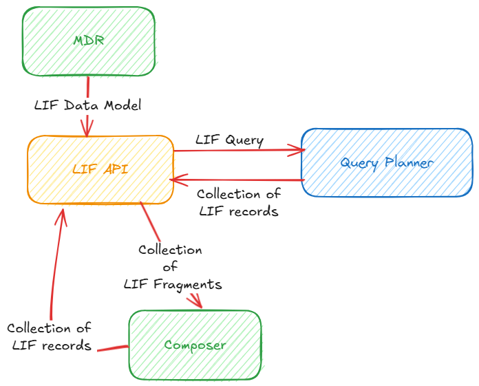
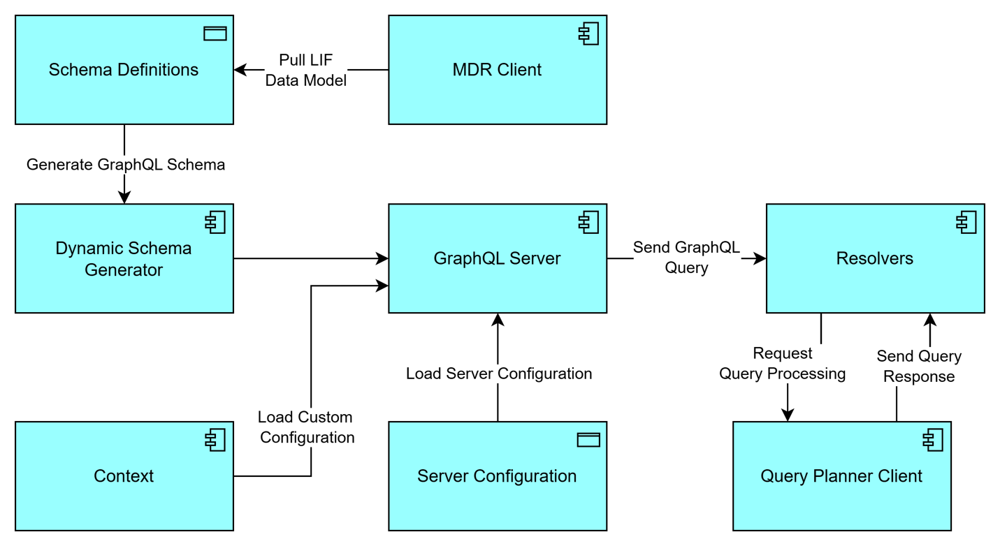

# LIF GraphQL API

Version 1.0.0

[Introduction](#introduction)

[Overview](#overview)

[Motivation](#motivation)

[Key Concepts](#key-concepts)

[GraphQL](#graphql)

[Schema Definitions](#schema-definitions)

[Resolvers](#resolvers)

[Design Proposal](#design-proposal)

[Interaction with Other LIF Components](#interaction-with-other-lif-components)

[Design Assumptions](#design-assumptions)

[Design Requirements](#design-requirements)

[Performance](#performance)

[Concurrency](#concurrency)

[High Level Design](#high-level-design)

[Dependencies](#dependencies)

[Exceptions and Errors](#exceptions-and-errors)

[Data validation exception](#data-validation-exception)

[Mapping exception](#mapping-exception)

[Example Usage](#example-usage)

[Detailed Design](#detailed-design)

[Implementation Model](#implementation-model)

[Tools and Technologies](#tools-and-technologies)

[Implementation Requirements](#implementation-requirements)

[Data Storage](#data-storage)

[State](#state)

[Concurrency](#concurrency-1)

[Sync/Async](#syncasync)

[External Services](#external-services)

[Deployment Design](#deployment-design)

[Deployment Environment](#deployment-environment)

[Deployment Model](#deployment-model)

[Deployment Requirements](#deployment-requirements)

[Dependencies](#dependencies-1)
 

# Introduction

## Overview

The LIF API provides an interface to the LIF system allowing applications and users to access, retrieve, and manipulate learner data available within the host organization and across partner organizations. By abstracting the underlying implementation of the LIF system, the LIF API standardizes communications allowing organizations to seamlessly exchange LIF-compliant learner data. The LIF API also provides an interface for external users and organizations to access and manipulate assets in the MDR via the MDR API. In addition, users can access the composition service via the LIF API to build a valid LIF record given a collection of LIF fragments.

## Motivation

To facilitate effective learner data exchange, a LIF system must provide a standard interface that decouples client requests from the internal implementations required to serve the requests. The users and organizations need a mechanism through which they can query and consume learner data uniformly even when they are maintained in proprietary state in their respective source systems. The LIF API empowers organizations to integrate their proprietary data systems, making learner data accessible to a wider range of applications and tools, as well as to partner organizations. The LIF API provides these capabilities by decoupling the underlying varied LIF system implementations from a standard access interface to query and update a LIF specific data shape.

## Key Concepts

### GraphQL

GraphQL is a strongly typed API architecture, which means that it requires a detailed description of the data, its structure, and data operations in the schema. GraphQL is a way to interact with APIs by asking for specific data in a structured format. Developed by Facebook, it provides a query language and a runtime for APIs supporting querying specific data in a structured format. Unlike REST that has multiple endpoints, a GraphQL API exposes a single endpoint and lets clients construct their own queries to fetch or modify data.

### Schema Definitions

Schemas define the structure and relationships in our LIF data model. They serve as a data contract between API clients and servers, ensuring that both parties agree on the shape and structure of the data. Schemas include data types, and the operations clients can perform on that data, namely queries, mutations, and subscriptions.

Types define the data structure that clients can query in your GraphQL API. Each type represents a different entity in the LIF data model. Queries fetch data from the GraphQL API. They are analogous to GET requests in the REST. A query specifies the shape and structure of the data to retrieve. Mutations modify data on the server. They are analogous to POST, PUT, PATCH, or DELETE requests in REST. A mutation specifies the changes to make.

### Resolvers

These are functions that tell GraphQL how to fetch the data for each field. When a client sends a query, the GraphQL server walks through the query tree and calls the appropriate resolvers to get data. A resolver allows for full control over how a specific shape of data is retrieved or updated. It also decouples the API from the underlying data sourcing mechanism, making the API agnostic to the backend mechanism to perform the data operations.

# Design Proposal

A LIF API provides proxy for three different services that include learner data query, MDR data query, and LIF record composition.

The learner data query service is supported by a GraphQL server that is initialized and started when the LIF API server is initialized. The LIF API server uses the schema definitions generated from the LIF model available in MDR to initialize the schema for the GraphQL server. Following the schema initialization, it maps resolver functions to corresponding schema elements, and the context is set up for any shared resources required to process and serve any request. Finally, the GraphQL server is started with schema, context, and server configuration.

Once the LIF API server is successfully set up with all its endpoints functional, it's ready to serve any requests targeted to the three endpoints.

For the LIF data request, the GraphQL server receives the request, and after parsing and validating it, invokes the appropriate Resolver function to fetch the respective shape of the LIF data model. The Resolver calls Query Planner with serialized GraphQL query and then receives a collection of partial LIF records. Finally, results of each resolver function are assembled to produce a structured response, which is returned to the client as LIF API response.

## Interaction with Other LIF Components

The LIF API component primarily interacts with the Query Planner to process and serve LIF data queries. It depends on the MDR to get schema definitions for GraphQL using the LIF data model, and it also interacts with the MDR to serve queries for MDR data assets such as the LIF data model, partner organizations, and mappings. It uses the Composer to serve any requests for composing LIF records from a collection of LIF fragments.

## Design Assumptions

1.  The LIF API is a proxy server providing a wrapper over three distinct APIs; LIF data API, MDR API, and Composer API.

2.  For the MDR API and the Composer API, it just routes the request to corresponding endpoints as configured in the routing configurations.

3.  The LIF data API is implemented using GraphQL with schema definitions generated from the LIF data model in the MDR.

4.  The GraphQL loads the schema definitions at startup during the initialization, and then it uses the same schema definitions to serve all data requests.

5.  The schema definition for the GraphQL server is updated manually when the LIF data model is updated in MDR following an appropriate fail-safe approach ensuring there is no disruption in the services and no inconsistencies in the response.

## Design Requirements

### Performance

The component should provide consistent performance irrespective of the volume of the requests and number of identity mapping records.

### Concurrency

Concurrent endpoint requests are addressed through parallel threads implemented with reliability considerations. More than one GraphQL server can be spun up with the same schema definitions.

## High Level Design

The LIF API is an API server component that provides three endpoints:

1.  LIF data endpoint: This endpoint is used to query specific LIF shapes based on the portions of the LIF data model that the organization has decided to share.

2.  MDR endpoint: This endpoint serves as a proxy for MDR API endpoints and can be used to query or save MDR assets available for public access.

3.  Composer endpoint: This endpoint serves as a proxy for the Composer service and can be used to build LIF records given a collection of LIF fragments.

The logical view given below displays the components of the LIF API for supporting LIF data endpoint.

1.  Schema Definitions - The schema definitions represent the LIF data model with all its types and their interdependencies

2.  Dynamic Schema Generator - This is a tool developed in the programming language of choice (Python) that generates a GraphQL schema given a LIF data model. It may use any custom configuration provided via the Context for producing output aligned to specific instructions.

3.  Resolvers - These functions pass appropriate GraphQL queries to the Query Planner Client for fetching required data to serve a client query.

4.  GraphQL Server - **GraphQL server** is a backend service that handles **GraphQL queries** from clients. A GraphQL server provides a **single endpoint** where clients can send flexible queries to request exactly the data they need.

5.  MDR Client\ The MDR client interacts with the MDR to pull LIF data model information from the MDR. This LIF data model includes schema definitions that are used to generate GraphQL schema for serving LIF API.

6.  Query Planner Client\ The Query Planner client invokes the Query Planner to fetch required data from LIF Cache or by running Orchestrator data pipelines. The Query Planner client may need to convert a GraphQL query into a JSONPath query that can be appropriately processed by the Query Planner.

7.  Server Configuration\ These settings ensure the GraphQL server is properly tailored to the client\'s runtime environment. They can include deployment-related configurations like environment variables, production-specific options, and monitoring tools. Additionally, server configuration defines how logging and error handling are managed.

8.  Context\ The **context** is a shared object available to all resolvers during the execution of a query or mutation. It acts as a container for data that should be accessible throughout a request's lifecycle. Context also provides information to Dynamic Schema Generator for producing appropriate GraphQL schema given a LIF data model.

### Interface

The LIF API provides an interface to the LIF data system enabling client programs and users to query specific LIF data efficiently. At a high level, the LIF API supports the following use cases:

1.  Query learner data - In this use case, a user queries for specific LIF data shapes aligned with the GraphQL schema supported by the LIF API. This query is received by the GraphQL server that parses and validates it, generating an Abstract Syntax Tree (AST). The GraphQL server then traverses the AST and invokes the appropriate resolvers that, in turn, call the Query Planner to fetch data from the LIF Cache. The GraphQL server assembles the responses returned by the resolvers and passes that to the LIF API, which returns that to the end user.

2.  Update learner data - For this use case, the LIF API acts as a proxy and passes the requests as is to the MDR API that processes and serves the requests appropriately as designed. The MDR API supports CRUD use cases for three key resources it maintains: LIF data models, partner organizations, and Mappings.

3.  Request compose - The LIF API forwards these requests to the Composer API that takes in the given collection of LIF fragments and, after validating them, builds a collection of LIF records and returns them to the requestor.

## Workflow Model

## Configurations

## Dependencies

## Exceptions and Errors

### Data validation exception

### Mapping exception

## Example Usage

# Detailed Design

## Implementation Model

## Tools and Technologies

The component is implemented using Python.

## Implementation Requirements

### Data Storage

### State

This component is stateless and does not maintain any information about any run.

### Concurrency

### Sync/Async

### External Services

# Deployment Design

## Deployment Environment

## Deployment Model

TBD

## Deployment Requirements

TBD

## Dependencies

TBD 
