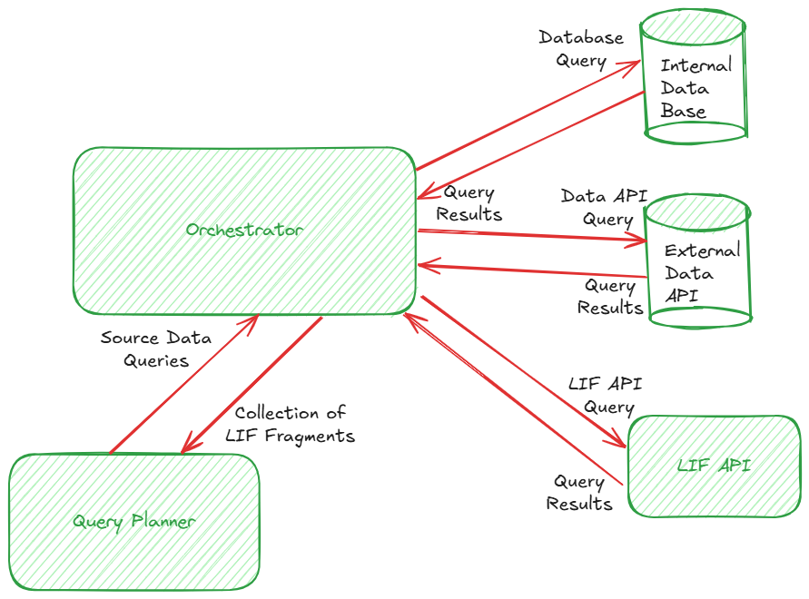
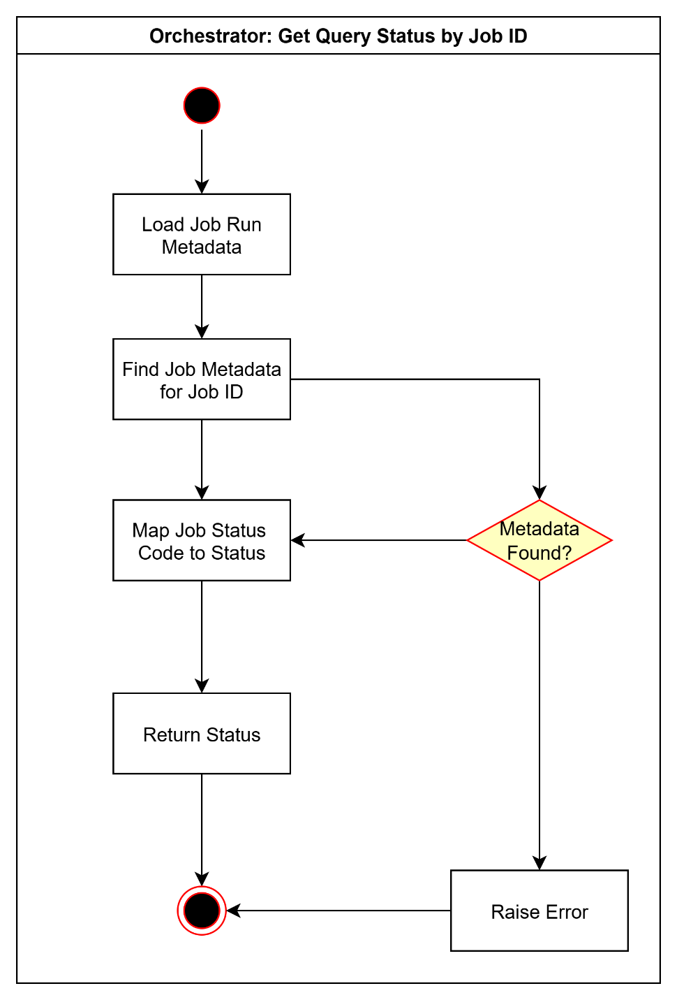
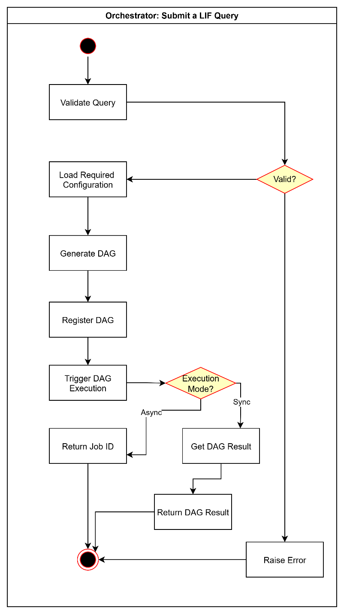
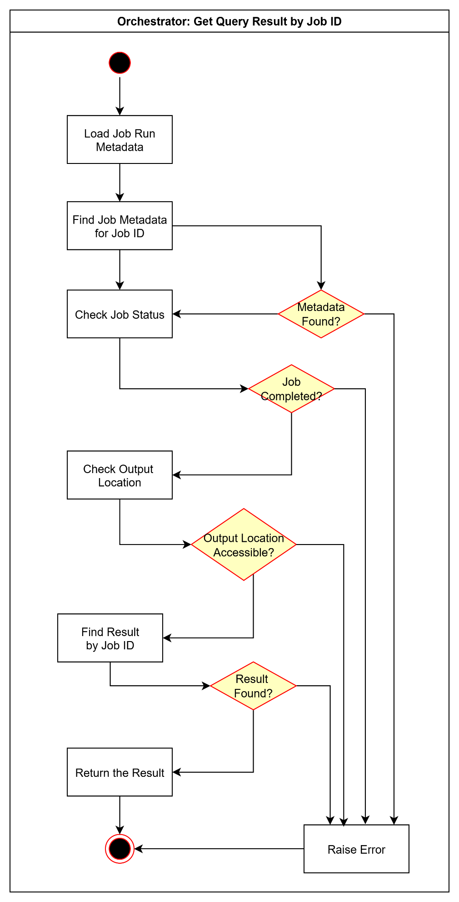
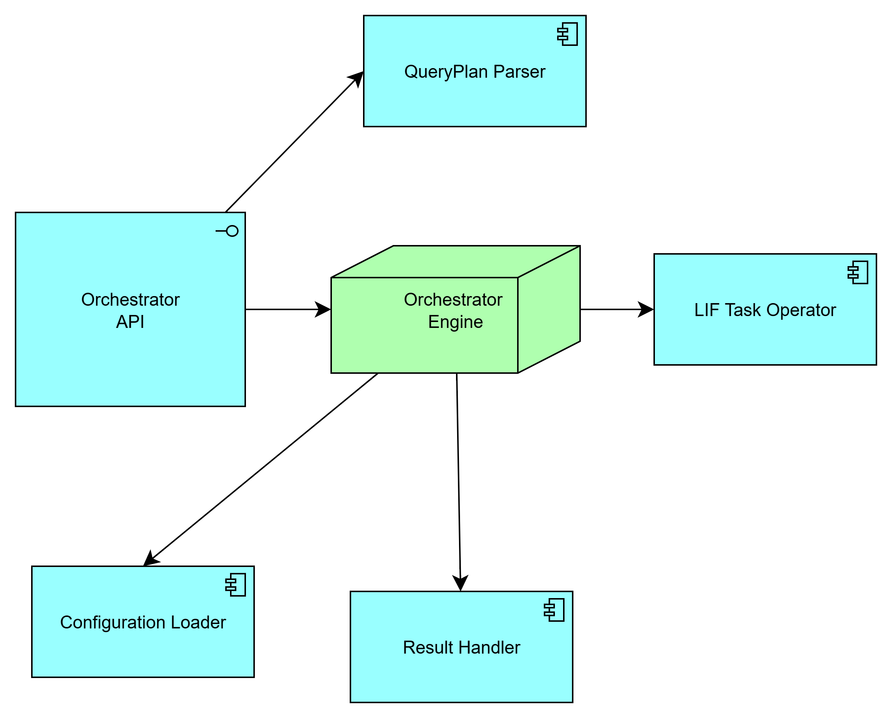

# LIF Orchestrator

Version 1.0.0

[Overview](#overview)

[Motivation](#motivation)

&nbsp;&nbsp;&nbsp;&nbsp;&nbsp;&nbsp;[Key Concepts](#key-concepts)

&nbsp;&nbsp;&nbsp;&nbsp;&nbsp;&nbsp;&nbsp;&nbsp;&nbsp;&nbsp;&nbsp;&nbsp;[DAG](#dag)

&nbsp;&nbsp;&nbsp;&nbsp;&nbsp;&nbsp;&nbsp;&nbsp;&nbsp;&nbsp;&nbsp;&nbsp;[Task](#task)

&nbsp;&nbsp;&nbsp;&nbsp;&nbsp;&nbsp;&nbsp;&nbsp;&nbsp;&nbsp;&nbsp;&nbsp;[Operator](#operator)

[Design Proposal](#design-proposal)

&nbsp;&nbsp;&nbsp;&nbsp;&nbsp;&nbsp;[Interaction with Other LIF Components](#interaction-with-other-lif-components)

&nbsp;&nbsp;&nbsp;&nbsp;&nbsp;&nbsp;[Design Assumptions](#design-assumptions)

&nbsp;&nbsp;&nbsp;&nbsp;&nbsp;&nbsp;[Design Requirements](#design-requirements)

&nbsp;&nbsp;&nbsp;&nbsp;&nbsp;&nbsp;&nbsp;&nbsp;&nbsp;&nbsp;&nbsp;&nbsp;[Performance](#performance)

&nbsp;&nbsp;&nbsp;&nbsp;&nbsp;&nbsp;&nbsp;&nbsp;&nbsp;&nbsp;&nbsp;&nbsp;[Concurrency](#concurrency)

&nbsp;&nbsp;&nbsp;&nbsp;&nbsp;&nbsp;&nbsp;&nbsp;&nbsp;&nbsp;&nbsp;&nbsp;[Plug-and-play](#plug-and-play)

&nbsp;&nbsp;&nbsp;&nbsp;&nbsp;&nbsp;[High Level Design](#high-level-design)

&nbsp;&nbsp;&nbsp;&nbsp;&nbsp;&nbsp;[Interface](#interface)

&nbsp;&nbsp;&nbsp;&nbsp;&nbsp;&nbsp;[Workflow Model](#workflow-model)

&nbsp;&nbsp;&nbsp;&nbsp;&nbsp;&nbsp;[Configuration](#configuration)

&nbsp;&nbsp;&nbsp;&nbsp;&nbsp;&nbsp;[Dependencies](#dependencies)

&nbsp;&nbsp;&nbsp;&nbsp;&nbsp;&nbsp;[Exceptions and Errors](#exceptions-and-errors)

&nbsp;&nbsp;&nbsp;&nbsp;&nbsp;&nbsp;&nbsp;&nbsp;&nbsp;&nbsp;&nbsp;&nbsp;[QueryParseException](#_heading=h.s0zmjfs6djpj)

&nbsp;&nbsp;&nbsp;&nbsp;&nbsp;&nbsp;&nbsp;&nbsp;&nbsp;&nbsp;&nbsp;&nbsp;[JobPostException](#jobpostexception)

&nbsp;&nbsp;&nbsp;&nbsp;&nbsp;&nbsp;&nbsp;&nbsp;&nbsp;&nbsp;&nbsp;&nbsp;[JobNotFoundException](#jobnotfoundexception)

&nbsp;&nbsp;&nbsp;&nbsp;&nbsp;&nbsp;&nbsp;&nbsp;&nbsp;&nbsp;&nbsp;&nbsp;[OperatorNotFoundException](#operatornotfoundexception)

&nbsp;&nbsp;&nbsp;&nbsp;&nbsp;&nbsp;&nbsp;&nbsp;&nbsp;&nbsp;&nbsp;&nbsp;[OperatorException](#operatorexception)

&nbsp;&nbsp;&nbsp;&nbsp;&nbsp;&nbsp;&nbsp;&nbsp;&nbsp;&nbsp;&nbsp;&nbsp;[OutputQueueNotAvailableException](#outputqueuenotavailableexception)

&nbsp;&nbsp;&nbsp;&nbsp;&nbsp;&nbsp;&nbsp;&nbsp;&nbsp;&nbsp;&nbsp;&nbsp;[OutputWriteException](#outputwriteexception)

&nbsp;&nbsp;&nbsp;&nbsp;&nbsp;&nbsp;&nbsp;&nbsp;&nbsp;&nbsp;&nbsp;&nbsp;[OutputReadException](#outputreadexception)

&nbsp;&nbsp;&nbsp;&nbsp;&nbsp;&nbsp;[Example Usage](#example-usage)

&nbsp;&nbsp;&nbsp;&nbsp;&nbsp;&nbsp;&nbsp;&nbsp;&nbsp;&nbsp;&nbsp;&nbsp;[Start/Stop Orchestrator](#startstop-orchestrator)

&nbsp;&nbsp;&nbsp;&nbsp;&nbsp;&nbsp;&nbsp;&nbsp;&nbsp;&nbsp;&nbsp;&nbsp;[Submit Query Job](#submit-query-job)

&nbsp;&nbsp;&nbsp;&nbsp;&nbsp;&nbsp;&nbsp;&nbsp;&nbsp;&nbsp;&nbsp;&nbsp;[Get Async Job Status](#get-async-job-status)

&nbsp;&nbsp;&nbsp;&nbsp;&nbsp;&nbsp;&nbsp;&nbsp;&nbsp;&nbsp;&nbsp;&nbsp;[Get Async Job Result](#get-async-job-result) [Detailed Design](#detailed-design)

&nbsp;&nbsp;&nbsp;&nbsp;&nbsp;&nbsp;[Implementation Model](#implementation-model)

&nbsp;&nbsp;&nbsp;&nbsp;&nbsp;&nbsp;[Tools and Technologies](#tools-and-technologies)

&nbsp;&nbsp;&nbsp;&nbsp;&nbsp;&nbsp;[Implementation Requirements](#implementation-requirements)

&nbsp;&nbsp;&nbsp;&nbsp;&nbsp;&nbsp;&nbsp;&nbsp;&nbsp;&nbsp;&nbsp;&nbsp;[Data Storage](#data-storage)

&nbsp;&nbsp;&nbsp;&nbsp;&nbsp;&nbsp;&nbsp;&nbsp;&nbsp;&nbsp;&nbsp;&nbsp;[State](#state)

&nbsp;&nbsp;&nbsp;&nbsp;&nbsp;&nbsp;&nbsp;&nbsp;&nbsp;&nbsp;&nbsp;&nbsp;[Concurrency](#concurrency-1)

&nbsp;&nbsp;&nbsp;&nbsp;&nbsp;&nbsp;&nbsp;&nbsp;&nbsp;&nbsp;&nbsp;&nbsp;[Sync/Async](#syncasync)

&nbsp;&nbsp;&nbsp;&nbsp;&nbsp;&nbsp;&nbsp;&nbsp;&nbsp;&nbsp;&nbsp;&nbsp;[External Services](#external-services)

[Deployment Design](#deployment-design)

&nbsp;&nbsp;&nbsp;&nbsp;&nbsp;&nbsp;[Deployment Environment](#deployment-environment)

&nbsp;&nbsp;&nbsp;&nbsp;&nbsp;&nbsp;[Deployment Model](#deployment-model)

&nbsp;&nbsp;&nbsp;&nbsp;&nbsp;&nbsp;[Deployment Requirements](#deployment-requirements)

&nbsp;&nbsp;&nbsp;&nbsp;&nbsp;&nbsp;[Dependencies](#dependencies-1)

# Overview

An **Orchestrator** plays a significant role in coordinating and running data jobs that include fetching data from and saving data back to the source data environments as specified in the jobs. **Orchestrator** ensures that the **Query Planner** can access the required data from its source and write back to it without having to know about the source. It facilitates a dynamic data environment over disparate data source systems enabling **Query Planner** to read and write seamlessly. **Orchestrators** help **Query Planner** fulfil LIF Queries that require data not available with the **LIF Cache** yet. While **LIF Cache** provides access to cached source data, **Orchestrator** offers real-time access to the source data systems.

The **Orchestrator** receives the data request from **Query Planner** in the form of source-specific data queries along with data models and mappings. It then uses this information to spin up either a standalone Adapter or a data pipeline involving adapter and translator components to perform necessary data operations on the respective source data systems to accomplish the request from Query Planner. **Orchestrators** can spin more than one data pipeline depending on the number of source data systems required to complete a specific data operation. It then collates the result of the data job and returns that back to the **Query Planner.**

# Motivation

LIF systems are designed to facilitate learner data exchange across LIF-compliant organizations. This data exchange requires access to data from different source data systems that own and maintain learner data. Though LIF systems do cache most frequently used data in the **LIF Cache**, it is not designed to be a source of truth system for learners. Therefore, LIF systems need a robust mechanism to access different source data environments using appropriate data connectors and transformers to read and write data in real-time when required to serve a given LIF query.

An **Orchestrator** with its ability to coordinate and run data jobs given specific information about the source data systems abstracts external data access enabling the LIF systems to serve LIF queries seamlessly. This abstraction provides a highly available, fault-tolerant, and integrated data environment over external data systems for the LIF system enabling real-time data exchange across heterogeneous data environments.

## Key Concepts

### DAG

A DAG (Directed Acyclic Graph) is a core abstraction used to define and manage workflows in an orchestration system. It encapsulates all necessary components required to schedule, execute, and monitor a workflow. Key attributes of a DAG include:

-   **Schedule**: Defines when and how often the workflow should run.

-   **Tasks**: Independent units of work that are executed by workers.

-   **Task Dependencies**: Specifies the execution order and interdependencies between tasks.

-   **Callbacks**: Optional actions triggered upon workflow completion, success, or failure.

-   **Additional Parameters**: Includes other configuration details such as retries, timeouts, SLAs, and resource settings.

Together, these attributes enable a DAG to fully describe the operational behavior of a workflow from start to finish.

### Task

A Task is the fundamental unit of execution in a workflow orchestration system. Tasks are organized into DAGs, where the execution order is determined by explicitly defined upstream and downstream dependencies.

The core principle when working with tasks is to define how they are connected:

-   An **upstream task** is one that must be completed before another task can start.

-   A **downstream task** depends on the successful completion of its upstream task.

Typically, tasks are declared first, followed by the specification of their relationships. Every DAG must have exactly one root task, which is the starting point of the workflow and has no upstream dependencies.

### Operator

An Operator is the execution component within the LIF orchestration environment responsible for performing a specific unit of work as part of a task. Operators are invoked by the orchestrator\'s task execution infrastructure.

Common types of operators include:

-   **Adapters**, which handle data extraction or mutation from source data systems

-   **Data Pipelines**, which includes multiple tasks involving Adapters, Transformers, and any other components for performing multi-step data movement.

Each operator encapsulates the logic required to carry out its assigned task, enabling modular, reusable, and scalable workflow execution.

# Design Proposal

The **Orchestrator** is a central component for coordinating, managing, and running data workflows to move and transform data across a LIF environment. Orchestrator swings into action when Query Planner cannot get all the data required to satisfy a given LIF query. The query planner analyzes the data returned from Cache against the LIF query and builds a query plan to fetch delta data. **Query Planner** submits this query to the **Orchestrator,** which then executes the query by running appropriate data jobs over heterogeneous data systems and returns the result.



Once a query is submitted to the Orchestrator it follows the steps listed below to perform the required data operation and return the result:

1.  It parses the submitted LIF query to appropriate DAG specifying required operator and configurations as expected by the orchestrator tool implemented.

2.  It registers the generated DAG with the orchestrator tool and triggers the DAG run and returns the corresponding Job ID.

3.  As the DAG runs, Task Operators such as Adapters or Pipeline configured are invoked.

4.  These operators load required configurations if not already provided in the DAG and then perform the requested data operation.

5.  Once the DAG run is complete, a configured hook is called depending on the success or failure of the run.

6.  If successful, a result handler hook is called to save the DAG result to a specified Queue location.

7.  The Orchestrator loads the result by Job ID and returns to the requestee component.

## Interaction with Other LIF Components

**Orchestrator** primarily interacts with **Query Planner** to process LIF queries. It also invokes **Adapter** while running a query to perform required data operations. It also interacts with external data source systems via corresponding Adapters.

## Design Assumptions

1.  The component maintains the state and result of every run. This behavior can be customized with an appropriate configuration.

2.  The component interacts with external resources, primarily data systems. However, any error in accessing external resources should not impact the component and its run.

3.  The component run as a comprehensive task engine that takes a request, runs the task, and returns the result.

4.  The component uses different hooks to access required resources from the LIF system such as Adapter, configurations, and output queue.

5.  The component saves its output to a queue and returns the result for a given job by Job ID.

6.  The component presumes that the source and target data models provided to it are correct and complete to translate the query and data.

7.  The component logs its run, and the log detail can be used to debug and assess its performance.

8.  In this design iteration, the component does not support translation of streaming LIF records or fragments. However, it is being designed such that supporting streaming should be an easy extension rather than a complete redesign if required.

## Design Requirements

### Performance

The component should provide consistent performance irrespective of the number and size of queries.

### Concurrency

The component should be able to scale as the number of concurrent users and number of concurrent queries increase.

### Plug-and-play

This design presumes that an off-the-shelf orchestration tool such Airflow or Dagster will be implemented to provide core orchestration functionality. The component should be designed to integrate with different orchestration frameworks as plug-and-play without requiring any significant redesign to its implementation, though some orchestration frameworks might require a wrapper depending on their specific needs.

## High Level Design

The **Orchestrator** is envisioned as an API server implementation built over an open-source workflow orchestration platform that serv as query engine over disparate and distributed data sources. The diagram below depicts the component model for the **Orchestrator**.



1.  **Orchestrator Engine**

This is an open-source platform such as *Airflow* or *Dagster* for orchestrating complex data pipelines and workflows. *Airflow* is relatively more mature for traditional ETL workflows and complex schedules while *Dagster* is better suited for data-centric development with asset lineage, testing, and type safety.

This component should satisfy following requirements:

-   Schedules and executes workflows (DAGs in Airflow, Jobs/Graphs in Dagster).

-   Manages job state, retries, and logging.

-   Integrates with a metadata store to track job executions.

**Note:** *Airflow* uses **Python-defined DAGs** with scheduling via the Airflow scheduler while *Dagster* uses the concept of **Software-Defined Assets (SDAs)** and uses Ops, Graphs, and Jobs with type-checked inputs/outputs.

2.  **Orchestrator API**

This is an interface component facilitating interaction between LIF system specifically Query Planner and the Orchestrator tool of choice. It provides a REST interface for Query Planner to submit LIF queries and receive LIF fragments as the result. The orchestrator API exposes following service endpoints:

1.  **post_job:** This endpoint can be used to submit a query to the orchestrator. The query is a LIF query qualified with source systems identifiers. The response to post_job request is either the result or a Job ID depending on whether the invocation is in sync or async mode. For async invocation, the Job ID can be used to track the status of the job and get results if the job is completed successfully.

> **Note:** The orchestration platforms such as Airflow or Dagster are designed to operate in async mode, but a sync call can be simulated by polling or using callbacks.

2.  **get_job_status:** This endpoint provides status for a given job identified by its Job ID. The status returned can be 'STARTING', 'RUNNING', 'FAILED', 'COMPLETED'.

3.  **get_job_result:** This endpoint can be used to retrieve the result for a given job identified by its Job ID that has been completed successfully. For a successfully completed job, it returns collection of LIF fragments returned by the respective data pipeline or adapter. For other jobs, it returns an appropriate message saying whether the job doesn't exist, it's still running, or it failed with errors.

&nbsp;
3.  **QueryPlan Parser**

A parser that reads query plan provided by the Query Planner and generates DAGs as appropriate for the orchestrator tool of choice. This component allows data jobs to be defined declaratively, outside of a specific orchestrator tool. It may use templating to generate DAG efficiently for a given LIF query.

Key responsibilities of this component include:

-   Load query plan with associated metadata including data source, adapter, translator, and any other configuration.

-   Generate a DAG with corresponding tasks such as fetch, transform, and store.

-   Register DAGs dynamically with the orchestrator tool.

> **Note:** If using *Airflow* as the orchestrator tool, this component can be integrated with Airflow\'s **DAG factory** pattern. *Dagster* has **Dynamic Job/Asset Factory** to provide similar functionality.

4.  **Configuration Loader**

This is a utility module that fetches configuration for adapters and data pipelines from a specified config store or registry. Its primary responsibility is to resolve Adapters, Translator, and other such task operators by loading their implementation module by their name. It can also load credentials, connection information, and data models required during data operations performed by LIF Task Operator.

These can be used inside our LIF Task Operators or DAG generation logic in QueryPlan Parser. Consider using **dynamic config injection** from secrets managers such as AWS Secrets, Vault, Airflow Connections, and Dagster EnvVar.

> **Note:** If using *Airflow*, **AirflowVar** or **AirflowConnection** can be used to maintain the configuration or can be directly accessed from the LIF Task Operator. With *Dagster*, **JobConfig** and **ResourceConfig** seem suitable for maintaining and passing configuration information to operators.

5.  **LIF Task Operator**

This is a hook component for the orchestrator tool that defines how a given task is executed. These operators wrap logic to invoke Adapter and other data pipeline tasks. This allows the orchestrator tool to execute LIF Adapters or any other LIF components without hard coding them into DAGs.

The task operator loads the config provided by the configuration loader and then invokes an appropriate Adapter or pipeline as specified in a DAG. It runs the component managing any exceptions and then saves the result as configured.

> **Note:** *Airflow* provides **PythonOperator** to invoke custom operators while with *Dagster*, we can use **Dagster Resource** to plug in the LIF Task Operator.

6.  **Output Queue**

This is a queue component that allows for storing and retrieving messages in a distributed environment where multiple components work together sharing a common staging area. The output queue provides a reliable and scalable queuing service to operators in the Orchestrator to store and retrieve messages. This component also helps different operators to run independently thereby improving the performance and fault-tolerance of the system as well as reducing any maintenance overhead because of the interdependencies among operators.

The Result handler can be configured with the output queue to save the final output of a query job.

7.  **Result Handler**

This is another hook component for the orchestrator tool to persist or route the output of DAG to a result queue or downstream function as configured. Orchestrator API can access the query result either as function callback or by retrieving it from the result queue by the corresponding Job ID.

> **Note:** This hook can be attached to DAG generated by Query Plan parser. In *Airflow*, this can be achieved by attaching the component to **on_success_callback** on a given DAG and in *Dagster*, **\@success_hook** on a given job can produce the desired result.

## Interface

The Orchestrator publishes its interface via Orchestrator API that provides service endpoints for following key functions for running and tracking data jobs:

1.  **Submit a LIF query for run**

Submits a structured LIF query to the orchestration engine for execution as a dynamic DAG (*Airflow*) or Job (*Dagster*). This includes following activities:

-   Validate the query specification schema.

-   Register or instantiate a job/pipeline using the orchestrator's API or templated job factory.

-   Trigger execution immediately.

-   Return a reference to the job ID for tracking.

2.  **Get status of a submitted LIF query**

Fetches the current execution status of a submitted query job (or pipeline run) using its unique run ID or job identifier from the orchestrator\'s metadata store or API. This includes following steps:

-   Connect to the orchestrator\'s API

-   Retrieve job run metadata using the Job ID

-   Map internal status codes to a friendly schema such as RUNNING, SUCCESS, FAILED.

-   Return a structured response.

3.  **Get result of a successfully completed LIF query**

Fetches the result that is collection of LIF fragments for a successfully completed LIF query job, from the result queue as configured. Includes following steps:

-   Validate the job has completed successfully using Job ID

-   Determine output location using config

-   Access and return the result

-   Handle and raise meaningful errors for incomplete or failed jobs

## Workflow Model

1.  **Submit a LIF query**

In this workflow, a client program such as Query Planner can submit a LIF query qualified with source system information. The query execution can be run in either sync or async mode depending on the configuration for the DAG execution mode. On successful submission, the client program gets Job ID for async run and result for sync run for the query job submitted. For async run, this Job ID can be used to track the status of the job and fetch the result of the job.



2.  **Get Query Status by Job ID**

This workflow helps track the status of a successfully submitted query job by a given job ID. If the Job ID is valid, then this activity returns status of the job that can be one of the following:

STARTING

RUNNING

COMPLETED

FAILED

If the Job ID is not valid or no information about the Job ID can be found, an appropriate error message is returned.



3.  **Get Query Result by Job ID**

This workflow allows for retrieving results for a successfully completed query job. If the Job ID is valid and it is completed successfully, this workflow will return result from the result queue in the form of collection of LIF fragments. While retrieving the result if there are any issues while accessing the result queue, appropriate error messages are returned.



## Configuration

The configuration for the Orchestrator will include elements to setup, generate DAG, run job, invoke operators and callbacks, persist output, and log and monitor DAG runs. The configuration for setup will include elements as required for setting up the orchestrator engine with off-the-shelf platform of choice that is *Airflow* or *Dagster*.

## Dependencies

## Exceptions and Errors

### QueryParseException

This exception occurs when a LIF query doesn't pass the validation checks while generating the corresponding DAG.

### JobPostException

This exception occurs when the Orchestrator API cannot post the DAG to the Orchestrator Engine.

### JobNotFoundException

This exception occurs when the Orchestrator cannot find a job by given Job ID

### OperatorNotFoundException

This exception occurs when an operator such as Adapter or Data Pipeline is not found in the registry

### OperatorException

This exception is thrown by an operator when there is an error during its initiatlization or run.

### OutputQueueNotAvailableException

This exception occurs when the Orchestrator Engine cannot access the output queue as configured.

### OutputWriteException

This exception occurs when the output queue cannot be written to.

### OutputReadException

This exception occurs when the output queue cannot be read from.

## Example Usage

### Start/Stop Orchestrator

```
start_orchestrator

stop_orchestrator
```

### Submit Query Job
```
orchestrator/post_job/
```
### Get Async Job Status
```
orchestrator/get_job_status/job_id
```
### Get Async Job Result
```
orchestrator/get_job_result/job_id
```
# Detailed Design

## Implementation Model

## Tools and Technologies

The component is implemented using Python.

## Implementation Requirements

### Data Storage

### State

This component is stateless and does not maintain any information about any run.

### Concurrency

### Sync/Async

### External Services

# Deployment Design

## Deployment Environment

## Deployment Model

TBD

## Deployment Requirements

TBD

## Dependencies

TBD 
