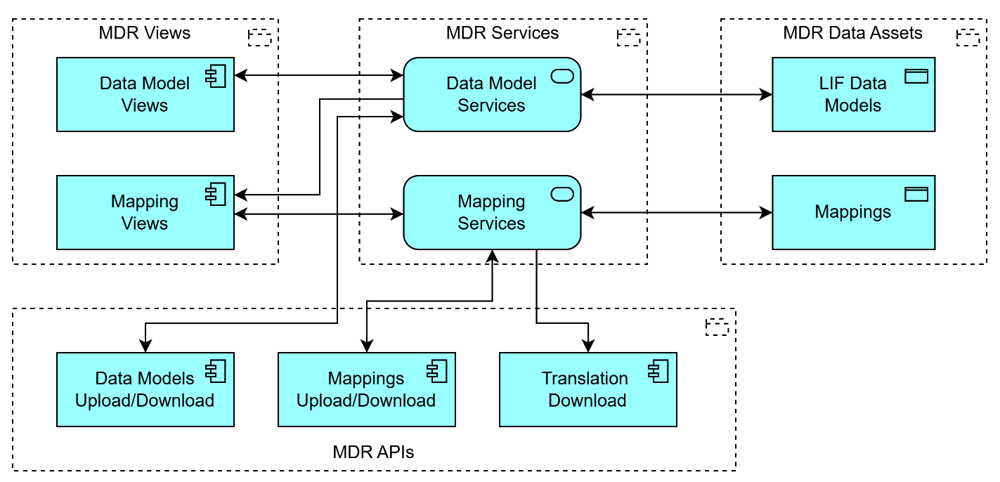
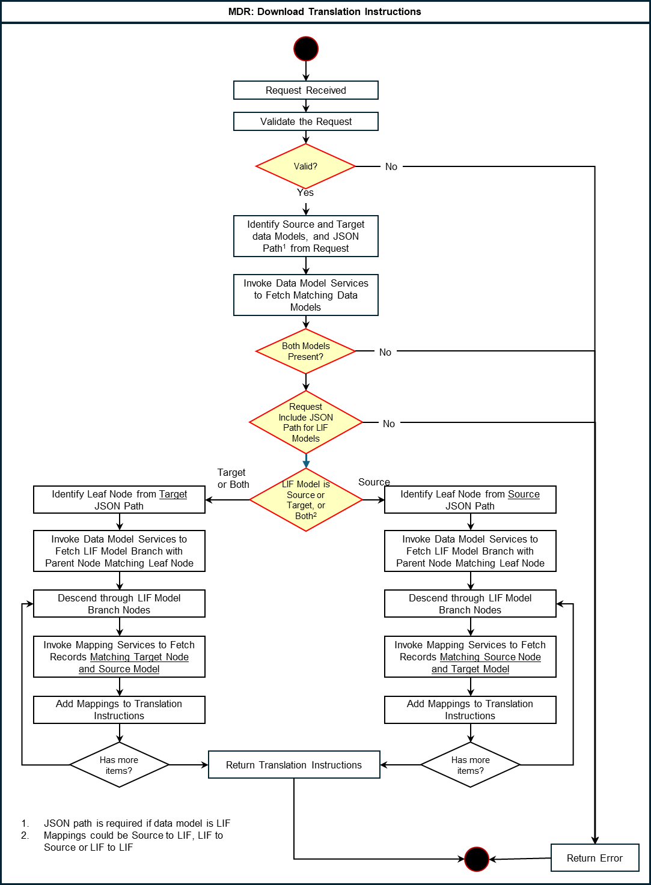
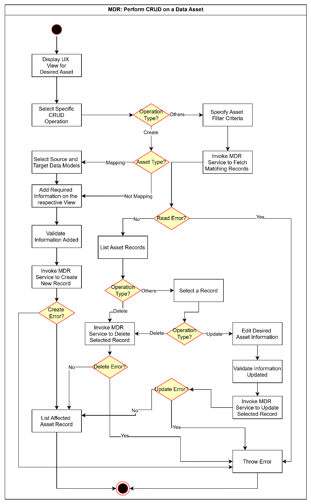
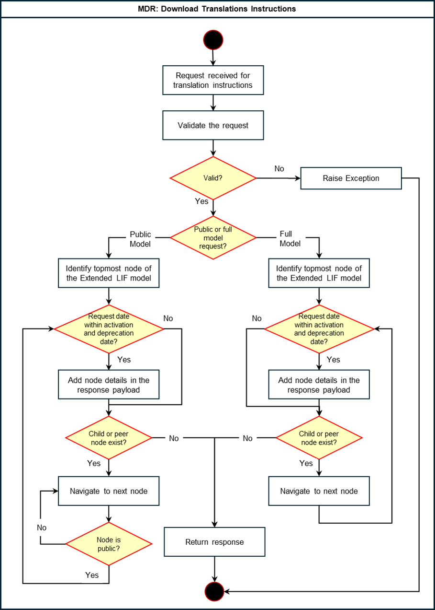
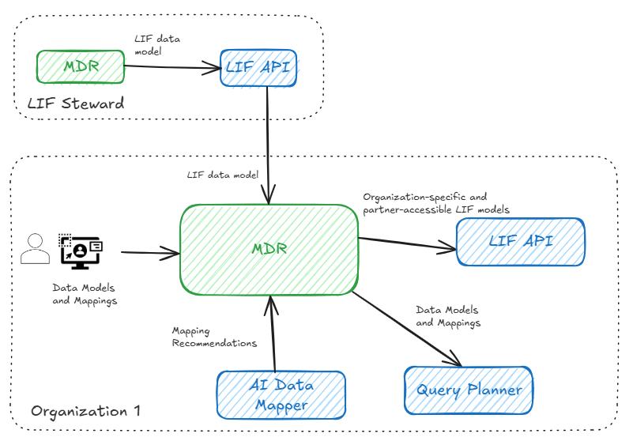
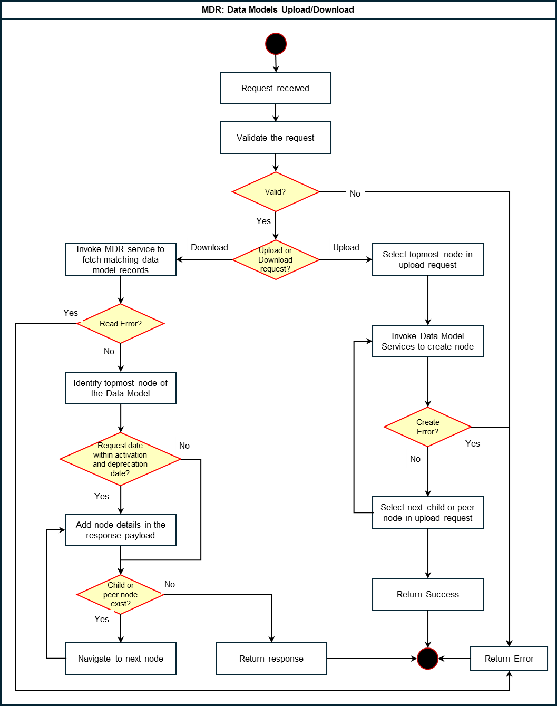

# Metadata Repository (MDR)

Version 1.0.0

Table of Contents

[Introduction](#introduction)

&nbsp;&nbsp;&nbsp;&nbsp;&nbsp;&nbsp;[Overview](#overview)

&nbsp;&nbsp;&nbsp;&nbsp;&nbsp;&nbsp;[Motivation](#motivation)

&nbsp;&nbsp;&nbsp;&nbsp;&nbsp;&nbsp;[Key Concepts](#key-concepts)

[Design Proposal](#design-proposal)

&nbsp;&nbsp;&nbsp;&nbsp;&nbsp;&nbsp;[Functional Requirements](#functional-requirements)

&nbsp;&nbsp;&nbsp;&nbsp;&nbsp;&nbsp;[Interaction with Other LIF Components](#interaction-with-other-lif-components)

&nbsp;&nbsp;&nbsp;&nbsp;&nbsp;&nbsp;[Design Assumptions](#design-assumptions)

&nbsp;&nbsp;&nbsp;&nbsp;&nbsp;&nbsp;[Design Requirements](#design-requirements)

&nbsp;&nbsp;&nbsp;&nbsp;&nbsp;&nbsp;&nbsp;&nbsp;&nbsp;&nbsp;&nbsp;&nbsp;[Performance](#performance)

&nbsp;&nbsp;&nbsp;&nbsp;&nbsp;&nbsp;&nbsp;&nbsp;&nbsp;&nbsp;&nbsp;&nbsp;[Concurrency](#concurrency)

&nbsp;&nbsp;&nbsp;&nbsp;&nbsp;&nbsp;&nbsp;&nbsp;&nbsp;&nbsp;&nbsp;&nbsp;[High Availability](#high-availability)

&nbsp;&nbsp;&nbsp;&nbsp;&nbsp;&nbsp;[High Level Design](#high-level-design)

&nbsp;&nbsp;&nbsp;&nbsp;&nbsp;&nbsp;[Workflow Model](#workflow-model)

&nbsp;&nbsp;&nbsp;&nbsp;&nbsp;&nbsp;[Dependencies](#dependencies)

&nbsp;&nbsp;&nbsp;&nbsp;&nbsp;&nbsp;[Exceptions and Errors](#exceptions-and-errors)

&nbsp;&nbsp;&nbsp;&nbsp;&nbsp;&nbsp;&nbsp;&nbsp;&nbsp;&nbsp;&nbsp;&nbsp;[Data validation exception](#data-validation-exception)

&nbsp;&nbsp;&nbsp;&nbsp;&nbsp;&nbsp;[Example Usage](#example-usage)

[Detailed Design](#detailed-design)

&nbsp;&nbsp;&nbsp;&nbsp;&nbsp;&nbsp;[Implementation Model](#implementation-model)

&nbsp;&nbsp;&nbsp;&nbsp;&nbsp;&nbsp;[Tools and Technologies](#tools-and-technologies)

&nbsp;&nbsp;&nbsp;&nbsp;&nbsp;&nbsp;[Implementation Requirements](#implementation-requirements)

&nbsp;&nbsp;&nbsp;&nbsp;&nbsp;&nbsp;&nbsp;&nbsp;&nbsp;&nbsp;&nbsp;&nbsp;[Data Storage](#data-storage)

&nbsp;&nbsp;&nbsp;&nbsp;&nbsp;&nbsp;&nbsp;&nbsp;&nbsp;&nbsp;&nbsp;&nbsp;[State](#state)

&nbsp;&nbsp;&nbsp;&nbsp;&nbsp;&nbsp;&nbsp;&nbsp;&nbsp;&nbsp;&nbsp;&nbsp;[Concurrency](#concurrency-1)

&nbsp;&nbsp;&nbsp;&nbsp;&nbsp;&nbsp;&nbsp;&nbsp;&nbsp;&nbsp;&nbsp;&nbsp;[Sync/Async](#syncasync)

&nbsp;&nbsp;&nbsp;&nbsp;&nbsp;&nbsp;&nbsp;&nbsp;&nbsp;&nbsp;&nbsp;&nbsp;[External Services](#external-services)

[Deployment Design](#deployment-design)

&nbsp;&nbsp;&nbsp;&nbsp;&nbsp;&nbsp;[Deployment Environment](#deployment-environment)

&nbsp;&nbsp;&nbsp;&nbsp;&nbsp;&nbsp;[Deployment Model](#deployment-model)

&nbsp;&nbsp;&nbsp;&nbsp;&nbsp;&nbsp;[Deployment Requirements](#deployment-requirements)

&nbsp;&nbsp;&nbsp;&nbsp;&nbsp;&nbsp;[Dependencies](#dependencies-1)

# Introduction

## Overview

The **Metadata Repository (MDR)** is a key component of LIF. It provides the capabilities to maintain the *LIF data model* in all of its iterations---including an *organization-specific LIF data model* and *partner LIF data models.* The **MDR** and *LIF data model* will be maintained by the steward or organization governing LIF.

The **MDR** is a standalone component that serves as the LIF system of record. It is where individuals from implementing organizations maintain their *organization-specific LIF data model* and *partner LIF data models* through a graphical user interface.

Additionally, the **MDR** provides the capability for the organization to maintain source data model(s) and mappings to transform data into a structure aligned to the *organization-specific LIF data model*.

The **MDR** will enable the organization to define which elements of its *organization-specific LIF data model* can be shared externally as its *partner-accessible LIF data model*. As a Possible Future Roadmap Item, the **MDR** will also allow the retrieval of the *partner-accessible LIF data model* from partners that have allowed for queries via **LIF API**.

## Motivation

A primary objective of the LIF project is to facilitate learner data exchange by using a LIF-compliant data structure across organizations. This requires the LIF components to accept queries and produce *LIF records* for one or more learners, which are composed of *LIF fragments* from disparate internal systems and external organizations. Data is returned to the requesting organization in a LIF-compliant format (through **Adapters** and **Data Pipelines**), even if original source data was in another format.

To serve this objective, the LIF components must understand the structure of both the LIF-compliant and source-formatted data, as well as the transformation logic between the two. To increase data availability, the LIF **MDR** must also support organizational sharing of their structures of available LIF data with partners.

## Key Concepts

### LIF data model

The *LIF data model* will be maintained and governed by the steward and will be made available to the LIF community to extend as needed. Extensions and modifications made by LIF implementers will be reviewed by the steward and incorporated into the *LIF data model*.

The *LIF data model* is a person-centric, hierarchical data structure that organizes information in a tree-like format (i.e., branches), where each item is linked to a single parent and ultimately rolls up to the learner via *LIF record*. It enables a clear representation of nested relationships, such as a person's courses, credential awards, demographics, and more.

The *LIF data model* strives to be version-less. Activation and deprecation dates assigned to its elements define the model\'s structure for any given date.

### Organization-specific LIF data model

When an organization implements LIF, the elements of the *LIF data model* are explicitly included for inheritance to form the *organization-specific LIF data model*. The implementer may add new elements to the *organization-specific LIF data model* or constrain it by excluding base elements or values based on the organization's needs.

Possible Future Roadmap Item: Any deprecated elements of the *LIF data model* will be excluded from the structure of the *organization-specific LIF data model* as of their deprecation date and will not be included in data model extracts when the requested model date is after the deprecation date, unless they are explicitly added as organization-specific elements.

### Partner-accessible LIF data model

Organizations can declare specific Entities and Attributes in their *organization-specific LIF model* as partner-accessible (Public), defining a subset of their model as the *partner-accessible LIF data model*. These elements are discoverable by partner organizations through their **LIF APIs**. The rest of the elements are not discoverable by partner organizations but remain discoverable internally.

The implementing organization can retrieve the *partner-accessible LIF data model* published by partners and potentially request corresponding data.

### Source data model

The *source data model* refers to the structure of source data that the organization has decided to request and eventually incorporate into its LIF implementation. This data is generated by the source adapters retrieving information from the organization's source systems and is translated into a specific LIF-compliant JSON format upon receipt.

### LIF record

A *LIF record* is a single holistic dataset that contains all available information related to one learner. A *LIF record* is represented as a JSON document. While a *LIF record* may aspire to have all information related to a given learner (i.e., "complete"), it realistically contains only partial data at any point of time, as there will always be some information potentially not contained within the record. Therefore, the *LIF record* returned to the user is referred to as "holistic" or "full," but never "complete."

### LIF fragment

A *LIF fragment* is a partial learner information dataset containing data for a given part of a holistic *LIF record* corresponding to a specific branch of the *LIF record*. A *LIF fragment* contains a fragment path and the corresponding LIF data structure. The fragment path is the semantic path of the associated data structure relative to the root of the *LIF record*. This fragment path can be represented as a JSON Path expression such as $.person.attendance.

A sample *LIF fragment* may look like the following:

```
{
	"$.person.attendance": {
		// LIF data part
	}
}
```

# Design Proposal

The **MDR** serves as the system of record for the *LIF data model*, as well as for the specific data models and mappings of the organizations implementing LIF. Key data elements include:

-   The *LIF data model,* which is expressed as a hierarchical structure of entities, attributes and enumerated values. It is maintained by the steward and synchronized (Possible Future Roadmap Item) in the organization's LIF instance

-   *Organization-specific LIF model*, which the organization derived from the steward-maintained *LIF data model* and extended or constrained to meet its specific needs

-   An indicator designating whether a particular entity or attribute of the *organization-specific LIF model* is partner-accessible, thereby defining the organization's *partner-accessible (Public) LIF data model*

-   A directory view of external partner LIF data models that have been imported

-   *Source data model(s)* expressed as the entities, attributes, and enumerated values that make up the source JSON to be input into the other LIF components.

-   Transformation logic and mappings of entities, attributes and enumerated values from the *source data model(s)* to the *organization-specific LIF model* for translation



*Image 1: A simple diagram depicting how the MDR functions at a high-level*

At a high level, the **MDR** will support the following flow of data and relevant interactions with other LIF components.

-   The **MDR** will be populated by users in the organization with the data described above (e.g., *organization-specific data model* elements, *source data model and* mappings).

-   Upon request by the **Semantic Search MCP Server** (Possible Future Roadmap Item), the **MDR** will provide information on the *organization-specific LIF data model*

-   Upon request by the **LIF API**, the **MDR** will provide its *organization-specific and partner-accessible LIF data models*

-   (Possible Future Roadmap Item) Upon request through the click of a button by a user from the organization, the *LIF data model* in the organization's **MDR** will be updated with the version maintained by the steward. The organization may selectively propagate changes from the refreshed *LIF data model* to its *organization-specific LIF model*

-   A user from an organization may import the *partner-accessible LIF models* from other organizations and store them in their **MDR** for visibility and further analysis

## Functional Requirements

This component has the following specific requirements:

1. **LIF data model**  
	1.  **Goal:** Support the steward's ability to maintain the *LIF data model's* hierarchical structure through graphical user interface or by importing (Possible Future Roadmap Items) JSON schema file. The person-centric nature of LIF requires that all elements of the data model relate to the Person Entity.  
	2.  **Capabilities and Features**      
		1. **Entities**          
			1. Support for defining core data structures (e.g., Person, Organization)
			2. Ability to establish parent-child relationships between entities to support nested data representations
			3. Ability to enforce the person-centric nature of LIF by requiring that all elements of the *LIF data model* are ultimately relate to the Person Entity
			4. Ability to declare whether a branch of the *LIF data model*, defined as all children in a parent-child relationship path associated with an entity, is mutable      
		2. **Attributes**
			1. Ability to maintain definition of attribute including description, data type, example value, and mandatory/optional status
            2. Ability to associate multiple attributes (e.g., shortName, identifier, birthDate) to an entity          
            3. Ability to associate an attribute with multiple entities          
            4. Ability to declare if an attribute is query-able though **LIF API**      
        3. **Value Sets**
        	1. Ability to create enumerated lists of values for attributes (e.g., state, country)
		4. **Values**
			1.  Ability to assign individual values within value sets      
		5.  **Changes Over Time** 
			1.  Ability to associate activation and deprecation dates with elements of LIF data model to define its shape for a given date          

2. **Organization-specific LIF model**
	1.  **Goal:** Support ability for the organization to define its own LIF model by deriving it from the *LIF data model* and extending or constraining it.  
    2.  **Capabilities and Features**      
    	1.  **Model inheritance**
    		1.  Ability to explicitly include entities and attributes from the *LIF data model* for inheritance          
            2.  (Possible Future Roadmap Item) Ability to selectively adopt updates of the *LIF data model*
        2. **Model extensions**
        	1.  Ability to introduce new Entities and Attributes that are not present in the *LIF data model*
            2.  Ability to extend existing *LIF data model* Entities by adding organization-specific Attributes
            3.  Ability to define custom value sets or additional values to existing value sets
    	3. **Model constraints** 
    		1.  Ability to constrain the *LIF data model* by:
    			1.  Excluding specific Entities, Attributes, Value set and Values from the *organization-specific LIF model*
                2. Defining organization specific validation rules (e.g., data type restrictions, allowed value ranges)
        4. **Changes Over Time**
        	1.  Similar to the *LIF data model,* support the ability to associate activation and deprecation dates with elements of the model

3.  **Partner-accessible indicator**  
	1.  **Goal:** Support an organization's ability to indicate whether the data associated with a specific entity or attribute is available for partners
    2.  **Capabilities and Features**
    	1.  Ability to maintain the indicator at both the entity and attribute levels
        2. Ability to generate a *partner-accessible LIF data model* based on this indicator and make it available through in OpenAPI 3.x specifications for it to be retrieved by partners

4.  **CEDS, Ed-Fi and other standard data models**  
	1.  **Goal**: Support uploading of standard data models to ease maintenance of the source data model  
    2.  **Capabilities and Features**:
    	1. Ability to upload schema of standard data models such as CEDS, Ed-Fi and other in OpenAPI

5.  **Source data model:**  
	1.  **Goal:** Ability to maintain structure of source data model  
	2.  **Capabilities and Features:** Maintaining a source data model will require the same capabilities needed to maintain the LIF data model

6.  **Source Data to LIF Model Transformation:**  
	1.  **Goal**: Support an organization's ability to maintain information to transform source data models to its *organization-specific data model*  
    2.  **Capabilities and Features:**      
    	1.  Ability to maintain transformation rules from source data models to organization-specific LIF models. The following is a non-exhaustive list of such transformations:
			1. Direct Mapping: A *source data models* Attribute(s) directly mapped to *organization-specific LIF model* Attribute(s)
			2. Values Mapping: Discrete values of *source data models* for an Attribute mapped to discrete values of *organization-specific LIF models*
			3. Simple Transformation: Expressed using data transformation primitives such as equivalence, assignment, concatenation, substring extraction, splitting, and others
			4. Complex Transformations: Transformation requiring complex conditional logic using JSONata. For extremely complex transformations, one may prefer to write a Python processor separate from MDR housed transformations
			5. (Possible Future Roadmap Item) Mapping Document: Ability to generate mapping documents between models and make them available to the Query Planner
7.  **MDR Registry at Steward (Future):**  
	1.  **Goal:** Enable discoverability of *Partner-accessible LIF data models* gathered by the Steward  
    2.  **Capabilities and Features:**      
    	1.  Ability for the Steward to make *partner-accessible LIF data models* of LIF implementing organizations available to the community via the **LIF API**

## Interaction with Other LIF Components

This component may interact with the...
- **LIF API** which uses the *organization-specific LIF model* for its configuration
- **Translator and/or Orchestrator and/or Query Planner** to receive transformations/mappings and possibly data model schemas for validations
- **Query Planner** which invokes it to retrieve data model schemas for validations

## Design Assumptions

1.  The **MDR** serves as the LIF system of maintenance for data models, mappings and transformation. The system of record for LIF data models is a Github repo, and the system of record for transformations/mappings is the MDR.

2.  The **MDR** is a standalone component and is not dependent on any other LIF component for its core functionality

3.  The **MDR** does not require either an internal or external authentication mechanism

4.  The **MDR** must be designed for high availability and performance

## Design Requirements

### Performance

The component should provide consistent performance irrespective of the volume of the requests and number of records.

### Concurrency

The component should be able to support multiple concurrent requests without affecting performance considerably.

### High Availability

The component should support high availability by implementing sufficient redundancy with backup and restore capabilities.

## High Level Design

The high-level design for **MDR** envisions the component as a three-tier application following the MVC (Model-View-Controller) architecture pattern to manage and maintain key assets for a LIF implementation. These assets include:

1.  ***LIF data models:*** This maintains the core structure of the *LIF data model* that includes Entities, Attributes, and Value Sets. In addition, it may also include extensions and constraints.

2.  **Mappings:** This represents mapping and transformation logic between the *source data models and organization-specific LIF model*.



*Image 2: Logical diagram of the **MDR's** three-tier architecture*

The MVC pattern separates the **MDR** application into three main logical components:

1.  **MDR Data Assets:** These components represent the model part of the MVC and include key data assets that are maintained by the **MDR** using standard RDBMS.

2.  **MDR Services:** These services allow client programs and processes to perform lifecycle operations such as CRUD (Create, Read, Update, and Delete) on the **MDR**'**s** data assets. They act as the "controller" for the **MDR** application.

3.  **MDR Views and MDR APIs:** The **MDR** uses two types of views:
	-   **UX views** for end users performing lifecycle operations on MDR data assets  
    -   **MDR APIs** for other external and internal systems to perform upload/download operations on the **MDR** data assets. **MDR APIs** can also be invoked by scheduled jobs, such as a cron job, to fetch desired data models from a partner organization.

The separation of the three logical components helps organize code and make the application more modular, scalable, and easier to maintain.

## Workflow Model

The **MDR** primarily supports the following key workflows:

1.  CRUD operations on **MDR** data assets - Users can perform CRUD operations on all data assets using the respective UX views that invoke the corresponding **MDR** services to complete the requested operation.



*Image 3: Workflow diagram for CRUD operations performance*

2.  Upload/download of MDR data models - The **Query Planner**, **LIF API**, or any other component can invoke the **Data Models Download/Upload API** to download an *organization-specific LIF model* or upload a data model retrieved from a partner organization.



*Image 4: Workflow diagram for the upload/download of LIF data models*

3.  (Possible Future Roadmap Item) Get mappings - The **AI Data Mapper** and **Query Planner** can invoke the **Mappings API** to get mappings between elements of two data models or upload mappings.



*Image 5: Workflow diagram for mappings upload and download*

4.  (Possible Future Roadmap Item) Get translation instructions - The **Translator**, or any other component, can invoke the **Translation API** to retrieve translation instructions from the Mappings Asset. This is done by providing the source and target data models as parameters, along with the JSON path if either model is LIF-compliant.



*Image 6: Workflow diagram for the Translation Download API*

## Dependencies

None

## Exceptions and Errors

### Data validation exception

This exception occurs when uniqueness constraints are about to be violated during data insertion.

## Example Usage

TBD

# Possible Future Roadmap Items
- [LIF-631 Fetch OpenAPI schema from MDR instead of file](https://linear.app/lif/issue/LIF-631/fetch-openapi-schema-from-mdr-instead-of-file)
- [LIF-358 Add support to pull latest LIF data model from Github repo](https://linear.app/lif/issue/LIF-358/add-support-to-pull-latest-lif-data-model-from-github-repo)
- [LIF-352 Add support to MDR for updating schema via upload](https://linear.app/lif/issue/LIF-352/add-support-to-mdr-for-updating-schema-via-upload)
- [LIF-357 Add button to update data model by uploading an OpenAPI schema](https://linear.app/lif/issue/LIF-357/add-button-to-update-data-model-by-uploading-an-openapi-schema)
- [LIF-341 Ensure GET API is available in the MDR to provide translation instructions to translator in the appropriate format](https://linear.app/lif/issue/LIF-341/ensure-get-api-is-available-in-the-mdr-to-provide-translation)
- [LIF-369 Update MDR API to support GET Transformations by source and target attributes](https://linear.app/lif/issue/LIF-369/update-mdr-api-to-support-get-transformations-by-source-and-target)
- [LIF-364 Exclude entities and attributes from GET endpoints when DeprecationDate <= now](https://linear.app/lif/issue/LIF-364/exclude-entities-and-attributes-from-get-endpoints-when)