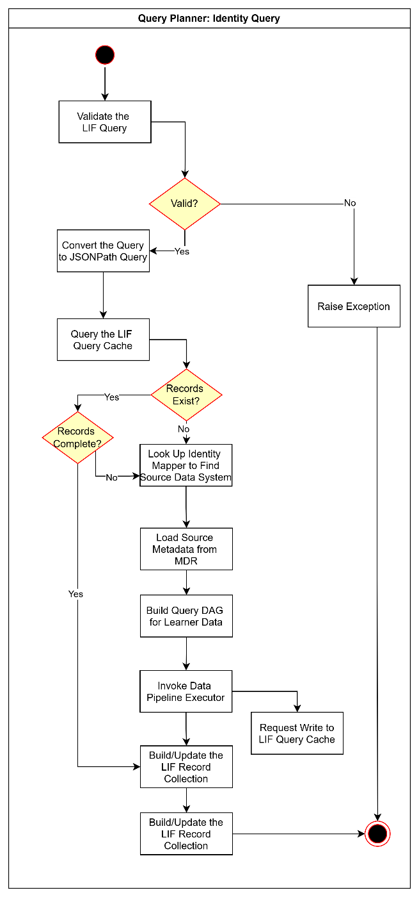
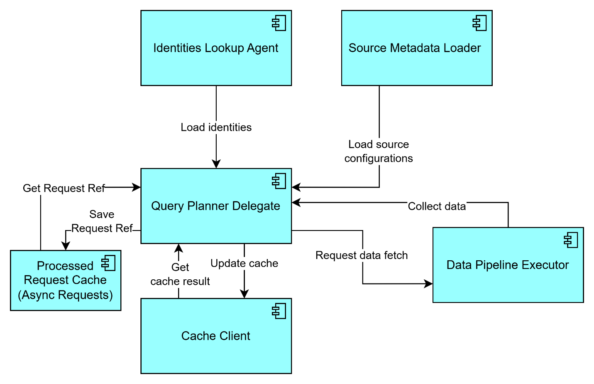
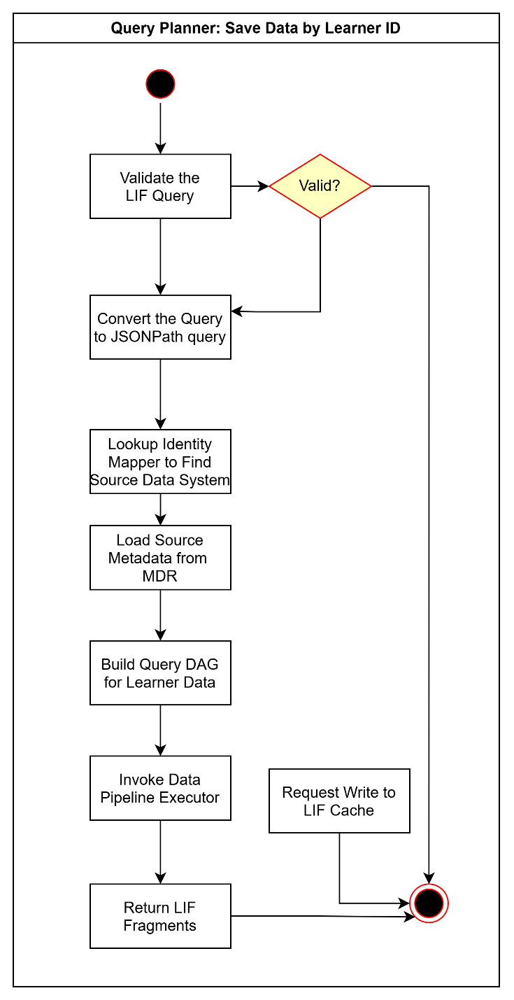
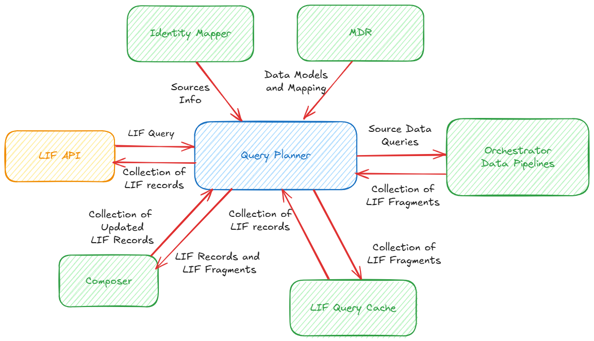
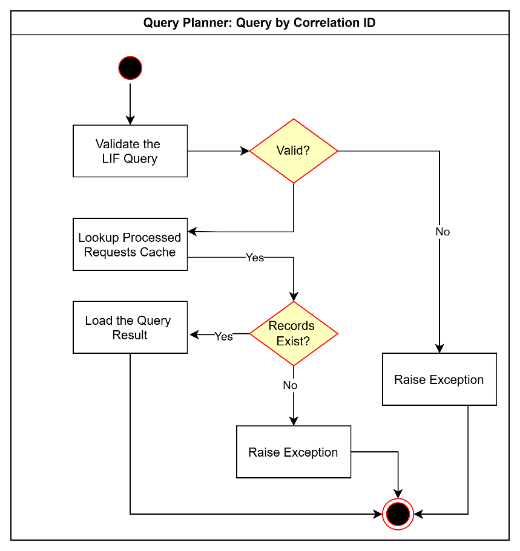
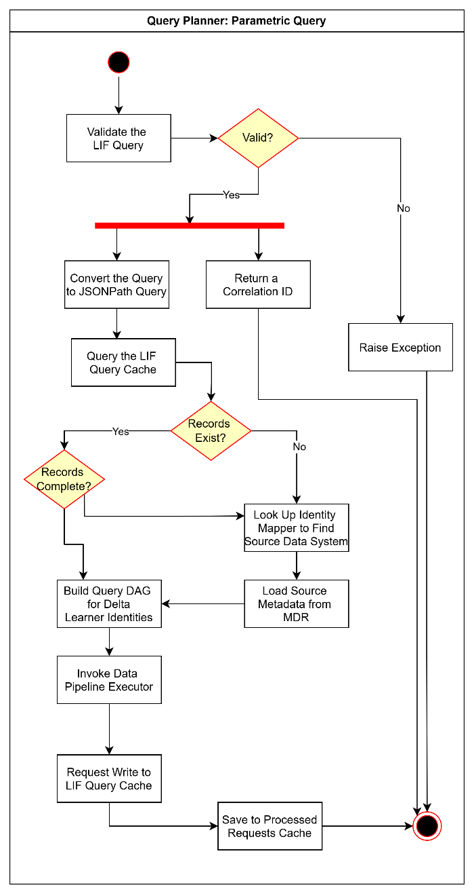

# LIF Query Planner

Version 1.0.0

**Table of Contents**

[Introduction](#introduction)

&nbsp;&nbsp;&nbsp;&nbsp;&nbsp;&nbsp;[Overview](#overview)

&nbsp;&nbsp;&nbsp;&nbsp;&nbsp;&nbsp;[Motivation](#motivation)

&nbsp;&nbsp;&nbsp;&nbsp;&nbsp;&nbsp;[Key Concepts](#key-concepts)

&nbsp;&nbsp;&nbsp;&nbsp;&nbsp;&nbsp;&nbsp;&nbsp;&nbsp;&nbsp;&nbsp;&nbsp;[LIF record](#LIF-record)

&nbsp;&nbsp;&nbsp;&nbsp;&nbsp;&nbsp;&nbsp;&nbsp;&nbsp;&nbsp;&nbsp;&nbsp;[LIF fragment](#LIF-fragment)

&nbsp;&nbsp;&nbsp;&nbsp;&nbsp;&nbsp;&nbsp;&nbsp;&nbsp;&nbsp;&nbsp;&nbsp;[LIF Query](#LIF-query)

&nbsp;&nbsp;&nbsp;&nbsp;&nbsp;&nbsp;&nbsp;&nbsp;&nbsp;&nbsp;&nbsp;&nbsp;[LIF query result](#LIF-query-result)

[Design Proposal](#design-proposal)

&nbsp;&nbsp;&nbsp;&nbsp;&nbsp;&nbsp;[Interaction with Other LIF Components](#interaction-with-other-lif-components)

&nbsp;&nbsp;&nbsp;&nbsp;&nbsp;&nbsp;[Design Assumptions](#design-assumptions)

&nbsp;&nbsp;&nbsp;&nbsp;&nbsp;&nbsp;[Design Requirements](#design-requirements)

&nbsp;&nbsp;&nbsp;&nbsp;&nbsp;&nbsp;&nbsp;&nbsp;&nbsp;&nbsp;&nbsp;&nbsp;[Performance](#performance)

&nbsp;&nbsp;&nbsp;&nbsp;&nbsp;&nbsp;&nbsp;&nbsp;&nbsp;&nbsp;&nbsp;&nbsp;[Concurrency](#concurrency)

&nbsp;&nbsp;&nbsp;&nbsp;&nbsp;&nbsp;&nbsp;&nbsp;&nbsp;&nbsp;&nbsp;&nbsp;[High Availability](#high-availability)

&nbsp;&nbsp;&nbsp;&nbsp;&nbsp;&nbsp;[High Level Design](#high-level-design)

&nbsp;&nbsp;&nbsp;&nbsp;&nbsp;&nbsp;[Interface](#interface)

&nbsp;&nbsp;&nbsp;&nbsp;&nbsp;&nbsp;[Workflow Model](#workflow-model)

&nbsp;&nbsp;&nbsp;&nbsp;&nbsp;&nbsp;[Configuration](#configuration)

&nbsp;&nbsp;&nbsp;&nbsp;&nbsp;&nbsp;[Dependencies](#dependencies)

&nbsp;&nbsp;&nbsp;&nbsp;&nbsp;&nbsp;[Exceptions and Errors](#exceptions-and-errors)

&nbsp;&nbsp;&nbsp;&nbsp;&nbsp;&nbsp;&nbsp;&nbsp;&nbsp;&nbsp;&nbsp;&nbsp;[Query Not Valid Exception](#query-not-valid-exception)

&nbsp;&nbsp;&nbsp;&nbsp;&nbsp;&nbsp;&nbsp;&nbsp;&nbsp;&nbsp;&nbsp;&nbsp;[Learner Not Found Exception](#learner-not-found-exception)

&nbsp;&nbsp;&nbsp;&nbsp;&nbsp;&nbsp;&nbsp;&nbsp;&nbsp;&nbsp;&nbsp;&nbsp;[Learner Data Not Found Exception](#learner-data-not-found-exception)

&nbsp;&nbsp;&nbsp;&nbsp;&nbsp;&nbsp;&nbsp;&nbsp;&nbsp;&nbsp;&nbsp;&nbsp;[Correlation ID Not Found Exception](#correlation-id-not-found-exception)

&nbsp;&nbsp;&nbsp;&nbsp;&nbsp;&nbsp;[Example Usage](#example-usage)

[Detailed Design](#detailed-design)

&nbsp;&nbsp;&nbsp;&nbsp;&nbsp;&nbsp;[Implementation Model](#implementation-model)

&nbsp;&nbsp;&nbsp;&nbsp;&nbsp;&nbsp;[Tools and Technologies](#tools-and-technologies)

&nbsp;&nbsp;&nbsp;&nbsp;&nbsp;&nbsp;[Implementation Requirements](#implementation-requirements)

&nbsp;&nbsp;&nbsp;&nbsp;&nbsp;&nbsp;&nbsp;&nbsp;&nbsp;&nbsp;&nbsp;&nbsp;[Data Storage](#data-storage)

&nbsp;&nbsp;&nbsp;&nbsp;&nbsp;&nbsp;&nbsp;&nbsp;&nbsp;&nbsp;&nbsp;&nbsp;[State](#state)

&nbsp;&nbsp;&nbsp;&nbsp;&nbsp;&nbsp;&nbsp;&nbsp;&nbsp;&nbsp;&nbsp;&nbsp;[Concurrency](#concurrency-1)

&nbsp;&nbsp;&nbsp;&nbsp;&nbsp;&nbsp;&nbsp;&nbsp;&nbsp;&nbsp;&nbsp;&nbsp;[Sync/Async](#syncasync)

&nbsp;&nbsp;&nbsp;&nbsp;&nbsp;&nbsp;&nbsp;&nbsp;&nbsp;&nbsp;&nbsp;&nbsp;[External Services](#external-services)

[Deployment Design](#deployment-design)

&nbsp;&nbsp;&nbsp;&nbsp;&nbsp;&nbsp;[Deployment Environment](#deployment-environment)

&nbsp;&nbsp;&nbsp;&nbsp;&nbsp;&nbsp;[Deployment Model](#deployment-model)

&nbsp;&nbsp;&nbsp;&nbsp;&nbsp;&nbsp;[Deployment Requirements](#deployment-requirements)

&nbsp;&nbsp;&nbsp;&nbsp;&nbsp;&nbsp;[Dependencies](#dependencies-1)


# Introduction

## Overview

The **Query Planner** is the central component of LIF. It processes and serves *LIF queries* from the **LIF API**. A *LIF query* supports both read and write requests. A *LIF read query* requests specific information about one or more learners, and it is fulfilled by one or more corresponding *LIF records*. A *LIF write query* includes specific learner information to be saved into a target source data system.

There are many ways a *LIF query* could be fulfilled, as LIF components serve different discrete functions that support the user receiving a holistic, context-rich record from one or multiple data sources and/or caches.

## Motivation

One of the primary objectives of LIF is to facilitate learner data exchange by using a LIF-compliant data structure across organizations. This requires LIF to accept queries and produce *LIF records* for one or more learners, which are composed of *LIF fragments* from disparate internal systems and external organizations. These organizations return data in a LIF-compliant format (through **Adapters** and **Data Pipelines**).

The **Query Planner** provides a uniform and unified query interface for the **LIF API** by hiding the complexity that arises from interacting with different internal and external data source systems to fetch required data to fulfill the *LIF query* with a *LIF record* that complies with the **LIF Data Model**.

This abstraction decouples the source data systems and organization(s) from the **LIF API,** which allows for the mechanism serving *LIF queries* to evolve independently from the LIF query service interfaced by the **LIF API**. This gives LIF the ability to serve *LIF queries* without dependency on the user knowing *exactly* which data sources they need to call to receive the information they are requesting.

In acting as a manager, the **Query Planner** also decouples other LIF components that need to work cohesively to appropriately process and serve a *LIF query*. This enables these components---such as **LIF Cache**, **Identity Mapper**, **MDR**, and **Orchestrator** with **Adapters** and **Translators**---to evolve and operate independently.

## Key Concepts

#### LIF record

A *LIF record* is a single holistic dataset that contains all available information related to one learner. A *LIF record* is represented as a JSON document with one and only one root node. While a *LIF record* may aspire to have all information related to a given learner (i.e., "complete"), it contains only partial data at any point of time, as there will always be some information potentially not contained within the record. Therefore, the *LIF record* returned to the user is referred to as "holistic" or "full," but never "complete."

#### LIF fragment

A *LIF fragment* is a partial learner information dataset containing data for a given part of a holistic *LIF record* corresponding to a specific branch of the *LIF record*. A *LIF fragment* contains a fragment path and the corresponding LIF data structure. The fragment path is the semantic path of the associated data structure relative to the root of the *LIF record*. This fragment path can be represented as a JSON Path expression such as ```$.person.attendance```.

A sample *LIF fragment* may look like the following:

```
{
	"$.person.attendance": {
		// LIF data part
	}
}
```

#### LIF Query

A *LIF query* may reference one or more learners and can be fulfilled by one or more *LIF records*. A *LIF query* is represented as a JSON path expression that includes all valid query expressions.

The *LIF query* supports both an identity query and a parametric query. The identity query allows for LIF to find learner information based on a learner ID. The parametric query allows for LIF to find learner information based on specific attributes.

In addition, the *LIF query* also supports retrieving query results by a Correlation ID for previously-submitted, long-running identity and parametric queries that were served asynchronously.

#### LIF query result

A *LIF query result* is a collection of *LIF fragments* with additional metadata information, such as source and timestamp. *LIF query results* are generated by **Data Pipelines** and/or **Adapters** that fetch data from different source systems.

A sample *LIF query result* may be represented with following JSON:

```
[
	{
		"source": "source_1",
		"timestamp": "",
		"fragments": [
			//collection of LIF fragments
		]
	},
	{
		"source": "source_2",
		"timestamp": "",
		"fragments": [
			//collection of LIF fragments
		]
	}
]
```

# Design Proposal

The **Query Planner** first processes the *LIF query* to identify the data that is required to be fetched or saved to serve the query. For serving these queries, it retrieves the required data from or saves the specified data to specific source data systems by coordinating with different LIF components, such as the **LIF Cache** and the **Orchestrator**. 

*Image 1: Diagram of how the **Query Planner** interacts with other components and the exchange of information that occurs between them*

The **Query Planner** will follow the steps below in accordance with its role in the LIF implementation to serve a *LIF read query.* Responses from other components are included in-line as relevant.

1.  To initiate the process of retrieving data, the **Query Planner** receives a *LIF query* from **LIF API**.

2.  For a read query, the **Query Planner** calls **LIF Cache** to find any relevant information to answer the query. The **LIF Cache** returns any available *LIF records* that it could find for the respective learner information required.

3.  The **Query Planner** then compares the collection of *LIF records* returned against the *LIF query* and identifies if there is additional data required.

4.  If additional data is required, the **Query Planner** then queries the **Identity Mapper** and **MDR** to get necessary information about source data systems that may be storing the relevant learner information. While the **Identity Mapper** provides information about the source organizations required to get the data for the specific learner(s) in question, the **MDR** provides source data models and mappings for appropriately fetching the data from the source data systems.

5.  The **Query Planner** then invokes the **Orchestrator** to spin up required data pipelines to fetch the additional data required based on findings from the **Identity Mapper** and **MDR**. The **Orchestrator** returns *LIF query* *result.*

6.  The **Query Planner** uses the *LIF query result* to update the existing list of *LIF records,* making them "complete" by having answered the *LIF query*. It is important to note that even if no data is returned from the data pipelines, the absence of information still "completes" this instance of composing a *LIF record.*

7.  Finally, the **Query Planner** sends the *LIF query result* to the **LIF Cache** to update the respective copies of *LIF records* there.

The **Query Planner** can serve a read query either asynchronously or synchronously, depending on whether it can be served entirely from **LIF Cache** or if it needs to fetch data from source data systems.

The **Query Planner** will follow the steps below in accordance with its role in LIF to serve a *LIF write query.* Responses from other components are included in-line as relevant.

1.  To initiate the process of saving data, the **Query Planner** receives a *LIF query* with specified learner data from **LIF API**.

2.  For a write query, the **Query Planner** queries the **Identity
    Mapper** and **MDR** to get necessary information about the source data system that maintains this learner information. While the **Identity Mapper** provides information about the source data systems required to save the data for the specific learner(s) in question, the **MDR** provides source data models and mappings for appropriately saving the data to the source data systems.

3.  The **Query Planner** then invokes the **Orchestrator** to spin up required data pipelines to write the learner data based on findings from the **Identity Mapper** and **MDR**. The **Orchestrator** returns *LIF query* *result* representing the records just saved.

4.  The **Query Planner** then sends the *LIF query result* to the **LIF Cache** to update the respective copies of *LIF records* there.

## Interaction with Other LIF Components

The **LIF Query Planner** is at the center of LIF, interacting with almost all other components except for the components that are used only within the **Orchestrator** data pipelines, such as the **Adapter** and **Translator**.

## Design Assumptions

1.  The **Query Planner** is a serverless and stateless component.

2.  The **Query Planner** will have the necessary configuration for enabling it to invoke other components and coordinate the invocations to serve the *LIF query*.

3.  The **Query Planner** must support both identity queries and parametric queries.

4.  The **Query Planner** should support both sync and async mode of query processing and response.

5.  The **Query Planner** maintains an internal cache for temporarily storing response for async queries.

6.  The **Query Planner** should not be tightly coupled with any helper components, such as the **LIF Cache** or **Orchestrator**, needed to serve a query request.

7.  The **Query Planner** should be lightweight, as to not become a blocker or single point of failure in the query processing cycle, and it should delegate as much as possible to helper components.

8.  The **Query Planner** must be designed for high availability and performance.

9.  The **Query Planner** receives *LIF query* and responds with collection of *LIF records* in JSON format.

10. The **Query Planner** should be fault-tolerant (i.e., failure to serve one query should not affect its capability to serve another).

## Design Requirements

### Performance

The component provides consistent performance ensuring fast response time for querying *LIF records* and saving *LIF query results*.

### Concurrency

The component should be able to support multiple concurrent requests without affecting performance considerably.

### High Availability

The component should support high availability by implementing sufficient redundancy with backup and restore capabilities.

## High Level Design

The **Query Planner** is a serverless component that includes one delegate object and several helper objects that are used to communicate with other LIF components to process and serve a *LIF query*. The diagram below depicts the logical view of a **Query Planner**.



*Image 2: Logical diagram of **Query Planner** delegate and helper objects inclusive of actions that define their internal relationships with each other*

1.  **Query Planner Delegate** - The **Query Planner** implements the logic for selecting and invoking the appropriate helper components to process and serve a *LIF query*. It uses a delegate pattern and acts as an intermediary by communicating with helper components and providing a simple interface to clients invoking the **Query Planner**.

2.  **Cache Client** - This is a service client that manages interactions with the **LIF Cache** to find *LIF records* for a given *LIF query* and update these *LIF records* with collection of *LIF fragments* fetched from running the **Orchestrator** data pipelines and/or adapters (the DAG).

3.  **Identities Lookup Agent** - The **Identities Lookup Agent** communicates with the **Identity Mapper** to find a list of identities for a given learner identifier in a *LIF query*.

4.  **Source Metadata Loader** - The **Source Metadata Loader** manages communication with the **MDR** to retrieve appropriate metadata for a given source data system. These metadata include the source data model, source-to-target mapping, and the target data model for the current LIF implementation.

5.  **Data Pipeline Executor** - This subcomponent calls the **Orchestrator** to spin up data pipelines and adapters with a query plan and then collects the result of those data pipelines once they are completed.

6.  **Processed Request Cache** - This is an internal cache for the **Query Planner** that maintains the results for prior *LIF queries* that were served asynchronously.<br /><br />
For an asynchronous query, the **Query Planner** returns a correlation ID that can be used to retrieve the result at a later point from the **Processed Requests Cache**. Once the **Query Planner** gets the result from the **LIF Cache**, the **Query Planner** stores the result in the **Processed Requests Cache** by the corresponding correlation ID.<br /><br />
The **Query Planner** then queries the **LIF Cache** with a correlation ID, uses the **Processed Request Cache** to fetch the *LIF records* from before, and returns then *LIF records* to the client.

### Interface

The **Query Planner** supports the following read and write query scenarios:

1.  Query with one or more learners by their IDs <br /><br />
The **Query Planner** supports identity queries that can be used to find information about one or more learners by their IDs. These IDs must be available from the **Identity Mapper** for the **Query Planner** to be able to be able to process them. The user can query for one or more learners and request the entire available *LIF record* or just specific information. Depending on the number of source data pipelines required and the volume of information required to serve the query, the **Query Planner** may heuristically determine to serve the request either synchronously or asynchronously.

2.  Query with one or more learner attributes <br /><br />
The **Query Planner** supports parametric queries where clients can request to find learners based on their specific attributes. These queries are always served in asynchronously. The **Query Planner** queries the **LIF Cache** to find all learners that match the query criteria. It then builds a query DAG with a list of learner IDs to exclude while querying the respective source data systems. It triggers all the required data pipelines to fetch additional learner data. Finally, it merges the existing learner data with the new learner data before returning the result.

3.  Query with one or more correlation ID <br /><br />
For all queries served asynchronously, the **Query Planner** provides correlation IDs as it invokes different helper components to retrieve the data required from the **LIF Cache** and via **Orchestrator** data pipelines and/or **Adapters**.
<br /><br />Once the data required to serve the query is available, the **Query Planner** stores the correlation ID with the resulting dataset (the collection of *LIF records*) in the **Processed Response Cache**.
<br /><br />As a query with the correlation ID is received, the **Query Planner** looks for the query reference in the internal **Processed Request Cache** and returns the result to the client.

The **Query Planner** supports the following write query scenarios:

1.  Save specific learner data by learner ID
<br /><br />The **Query Planner** supports saving specific learner data to underlying data storage. The **Identity Mapper** and **MDR** should have information about the data source system and necessary **Adapter** for writing this data appropriately to the user's LIF system. The **Query Planner** retrieves this information for building the appropriate pipeline DAG.
<br /><br />Based on the source metadata, the **Query Planner** spins up the **Orchestrator** data pipelines with the DAG to write the data to a target data source system. It receives the *LIF query result* representing the data saved from the **Orchestrator** once the pipelines complete successfully. The **Query Planner** then saves this query result to **LIF Cache** for future retrieval.

## Workflow Model

The **Query Planner** supports the following query and save scenarios:

1.  Query by one or more learner IDs
<br /><br />In this scenario, users provide one or more learner IDs for which they want data. This workflow occurs synchronously by default, but if the list of IDs is beyond a specified threshold size, the **Query Planner** may decide to serve it asynchronously.



*Image 3: Diagram of the high-level workflow for a query by one or more learner IDs*

1.  Query by one or more learner attributes
<br /><br />The user specifies one or more attributes for learners and initiates the asynchronous workflow. The **Query Planner** then searches the **LIF Cache** to find requested learner data matching to the specific learner attributes. If the request can be satisfied by the cache it synchronously returns the result. Otherwise, the **Query Planner** serves this type of request asynchronously by returning a correlation ID by which the user can retrieve the result later.
<br /><br />It then invokes the **Orchestrator** data pipelines to fetch any additional learner data from different source data systems that match the given attributes. In the second pass, it searches the **LIF Cache** and any required data pipelines.
<br /><br />Once all the data required to serve the query is available in the **Query Planner**, it uses the **Composer** to build a collection of *LIF records* from the collection of *LIF fragments* from the **LIF Cache** and **Orchestrator**. It then stores the collection of *LIF records* in the internal **Processed Response Cache** by mapping that with the correlation ID. It also pushes the *LIF fragments* received from the **Orchestrator** to the **LIF Cache** for updating respective learner data in the cache.



*Image 4: High-level workflow diagram for a query by attributes*

2.  Query by LIF query correlation ID
<br /><br />This query workflow enables clients to retrieve the result for the query sent earlier for which they received a correlation ID for obtaining the result later.



*Image 5: High-level workflow diagram for a query by correlation ID*

3.  Save specific learner data by Learner ID
<br /><br />This save-learner-data workflow enables clients to save specific learner data to the target data system.



*Image 6: High-level workflow diagram for a save by learner ID*

## Configuration

The **Query Planner** requires configuration to connect and interact with all helper components. It may also include mapping of internal data source systems with corresponding adapters.

A sample component configuration is as given below:

```
{
	"identity_mapper": {
		"api_endpoint": "",
		"api_key": ""
	},
	"mdr": {
		"api_endpoint": "",
		"api_key": ""
	},
	"orchestrator": {
		"invocation_api_endpoint": "",
		"output_api_endpoint": "",
		"api_key": ""
	},
	"query_cache": {
		"read_api_endpoint": "",
		"write_api_endpoint": "",
		"api_key": ""
	},
	"internal_cache": {
		"api_endpoint": ""
	},
}
```
Configuration for internal data source adapters is as follows:
```
[{
	"adapter_id": "",
	"datamodel_id": "",
	"datamodel_path": "",
	"mode": "read_only|write_only|read_and_write",
	"adapter": {
		"package": "",
		"main_module": ""
	}
}]
```

These configurations are provided to the **Query Planner** by the underlying infra settings, and the component is spun up with the appropriate configuration as specified.

## Dependencies

The quality and performance of this component depends on the capabilities of other helper components it depends on for serving LIF queries.

## Exceptions and Errors

### Query Not Valid Exception

This exception occurs when **LIF Cache** is not able to find data for a given query.

### Learner Not Found Exception

This exception occurs when a specific learner requested is not found in the **Identity Mapper**.

### Learner Data Not Found Exception

This exception occurs if a specific shape of learner data is not available in the **LIF Data Model** supported by this organization.

### Correlation ID Not Found Exception

This exception occurs if the **LIF Cache** is not able to connect to its underlying cache storage.

## Example Usage

```
query_planner = QueryPlanner(config)
records = query_planner.query(lif_query)
return records
```

# Detailed Design

This component implements a delegate pattern with helper or service client components of the various services it needs to process and serve a *LIF query*. This component is designed to be implemented as a serverless component that can be scaled on demand.

## Implementation Model

The **Query Planner** can be implemented as a serverless function.

## Tools and Technologies

The component is implemented using Python.

## Implementation Requirements

### Data Storage

This component uses internal cache storage to maintain results for async query temporarily as configured.

### State

This component is stateless and does not maintain any information about any run.

### Concurrency

Being a stateless component, it should be able to scale on demand to address multiple concurrent requests. However, the concurrency limit will depend on the capability of other helper components.

### Sync/Async

This component operates in both sync and async modes depending on the workload it determines to be required for serving a query request.

### External Services

This component does not call any external services but uses a number of internal components as specified in the high-level design.

# Deployment Design

## Deployment Environment

The component can be deployed in cloud using serverless infrastructure such as AWS Step Function or Azure Function. In the on-prem deployment environment, the component can be deployed as dependency along with other helper components such as the **LIF Cache**, **Identity Mapper**, **MDR**, and **Orchestrator**.

## Deployment Model

TBD

## Deployment Requirements

TBD

## Dependencies

TBD 
