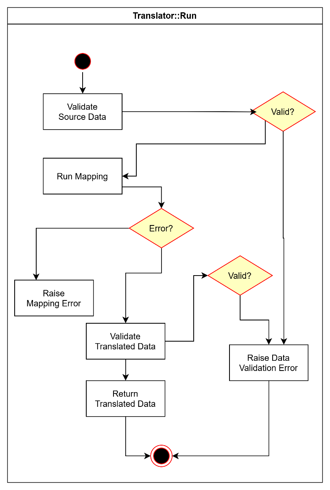
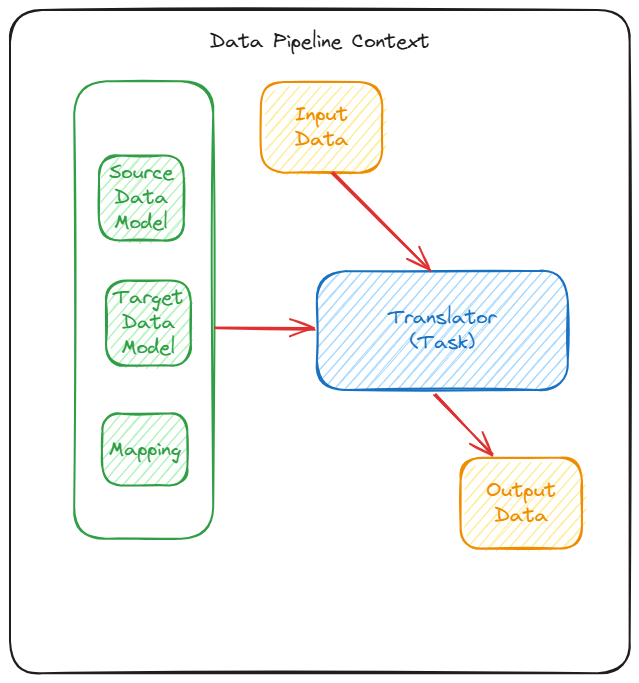

# Translator

Version 1.0.0

**Table of Contents**

[Overview](#overview)

[Motivation](#motivation)

[Design Proposal](#design-proposal)

&nbsp;&nbsp;&nbsp;&nbsp;&nbsp;&nbsp;[Key Concept](#key-concept)

&nbsp;&nbsp;&nbsp;&nbsp;&nbsp;&nbsp;[Functional Requirements](#functional-requirements)

&nbsp;&nbsp;&nbsp;&nbsp;&nbsp;&nbsp;[Interaction with Other LIF Components](#interaction-with-other-lif-components)

&nbsp;&nbsp;&nbsp;&nbsp;&nbsp;&nbsp;[Design Requirements](#design-requirements)

&nbsp;&nbsp;&nbsp;&nbsp;&nbsp;&nbsp;&nbsp;&nbsp;&nbsp;&nbsp;&nbsp;&nbsp;[Performance](#performance)

&nbsp;&nbsp;&nbsp;&nbsp;&nbsp;&nbsp;&nbsp;&nbsp;&nbsp;&nbsp;&nbsp;&nbsp;[Concurrency](#concurrency)

&nbsp;&nbsp;&nbsp;&nbsp;&nbsp;&nbsp;&nbsp;&nbsp;&nbsp;&nbsp;&nbsp;&nbsp;[Task model](#task-model)

&nbsp;&nbsp;&nbsp;&nbsp;&nbsp;&nbsp;&nbsp;&nbsp;&nbsp;&nbsp;&nbsp;&nbsp;[Plug-and-play](#plug-and-play)

&nbsp;&nbsp;&nbsp;&nbsp;&nbsp;&nbsp;[High Level Design](#high-level-design)

&nbsp;&nbsp;&nbsp;&nbsp;&nbsp;&nbsp;&nbsp;&nbsp;&nbsp;&nbsp;&nbsp;&nbsp;[Value Set Mapping](#value-set-mapping)

&nbsp;&nbsp;&nbsp;&nbsp;&nbsp;&nbsp;&nbsp;&nbsp;&nbsp;&nbsp;&nbsp;&nbsp;[Interface](#interface)

&nbsp;&nbsp;&nbsp;&nbsp;&nbsp;&nbsp;[Workflow Model](#after-successfully-building-the-target-dataset-it-validates-that-with-the-target-data-model-before-returning-that-to-the-underlying-pipeline-context.)

&nbsp;&nbsp;&nbsp;&nbsp;&nbsp;&nbsp;[Configuration](#configuration)

&nbsp;&nbsp;&nbsp;&nbsp;&nbsp;&nbsp;[Dependencies](#dependencies)

&nbsp;&nbsp;&nbsp;&nbsp;&nbsp;&nbsp;[Exceptions and Errors](#exceptions-and-errors)

&nbsp;&nbsp;&nbsp;&nbsp;&nbsp;&nbsp;&nbsp;&nbsp;&nbsp;&nbsp;&nbsp;&nbsp;[Data validation exception](#data-validation-exception)

&nbsp;&nbsp;&nbsp;&nbsp;&nbsp;&nbsp;&nbsp;&nbsp;&nbsp;&nbsp;&nbsp;&nbsp;[Mapping exception](#mapping-exception)

&nbsp;&nbsp;&nbsp;&nbsp;&nbsp;&nbsp;[Example Usage](#example-usage)

[Detailed Design](#detailed-design)

&nbsp;&nbsp;&nbsp;&nbsp;&nbsp;&nbsp;[Implementation Model](#implementation-model)

&nbsp;&nbsp;&nbsp;&nbsp;&nbsp;&nbsp;[Tools and Technologies](#tools-and-technologies)

&nbsp;&nbsp;&nbsp;&nbsp;&nbsp;&nbsp;[Implementation Requirements](#implementation-requirements)

&nbsp;&nbsp;&nbsp;&nbsp;&nbsp;&nbsp;&nbsp;&nbsp;&nbsp;&nbsp;&nbsp;&nbsp;[Data Storage](#data-storage)

&nbsp;&nbsp;&nbsp;&nbsp;&nbsp;&nbsp;&nbsp;&nbsp;&nbsp;&nbsp;&nbsp;&nbsp;[State](#state)

&nbsp;&nbsp;&nbsp;&nbsp;&nbsp;&nbsp;&nbsp;&nbsp;&nbsp;&nbsp;&nbsp;&nbsp;[Concurrency](#concurrency-1)

&nbsp;&nbsp;&nbsp;&nbsp;&nbsp;&nbsp;&nbsp;&nbsp;&nbsp;&nbsp;&nbsp;&nbsp;[Sync/Async](#syncasync)

&nbsp;&nbsp;&nbsp;&nbsp;&nbsp;&nbsp;&nbsp;&nbsp;&nbsp;&nbsp;&nbsp;&nbsp;[External Services](#external-services)

[Deployment Design](#deployment-design)

&nbsp;&nbsp;&nbsp;&nbsp;&nbsp;&nbsp;&nbsp;&nbsp;&nbsp;&nbsp;&nbsp;&nbsp;[Deployment Environment](#deployment-environment)

&nbsp;&nbsp;&nbsp;&nbsp;&nbsp;&nbsp;&nbsp;&nbsp;&nbsp;&nbsp;&nbsp;&nbsp;[Deployment Model](#deployment-model)

&nbsp;&nbsp;&nbsp;&nbsp;&nbsp;&nbsp;&nbsp;&nbsp;&nbsp;&nbsp;&nbsp;&nbsp;[Deployment Requirements](#deployment-requirements)

&nbsp;&nbsp;&nbsp;&nbsp;&nbsp;&nbsp;&nbsp;&nbsp;&nbsp;&nbsp;&nbsp;&nbsp;[Dependencies](#dependencies-1)


# Overview

The **Translator** transforms a source JSON document into a target JSON document when provided with relevant translation instructions. This component ensures that data from various source systems are appropriately translated to the **LIF Data Model** and then returns the translated JSON document.

# Motivation

When the **LIF API** receives a data request from a user, it may require that data be fetched from one or more sources or source organizations that maintain their data in some proprietary format that is not aligned to the **LIF Data Model.**

To improve efficiency and enforce conformance, data fetched from non-LIF source systems must be translated to the appropriate **LIF Data Model** format before being passed along to downstream LIF components.

# Design Proposal

## Key Concept

The **Translator** is a standalone component that maps an input dataset from a source model to a target model (in this case, the **LIF Data Model**) as specified in the translation instructions. The **Translator** operates as an atomic task in a data pipeline environment (**Pipeline Tasks**) that moves data from the source data systems to the host environment.

The **Pipeline Tasks** represent the set of tasks required to fetch data from a given data source system. It includes three key tasks:

| **Step** | **Task**  | **Component**  |
|---------- | ------------ | ---------------------------------|
| 1 | Translate a LIF data query to a source data query | Query Planner |             
| 2 | Fetch data from a source system or organization | Adapter | 
| 3 | Translate the source data set to the LIF data set | Translator |


Translation tasks are performed by the **Translator,** while data fetching is done by an **Adapter**. The **Translator** must be able to translate JSON documents representing a query from **LIF Data Model** to the source data model (Possible Future Roadmap Item) and a dataset from the source data model to the **LIF Data Model**. This in effect requires the component to be able to traverse the mappings in both directions which MAY NOT be true if a mapping is not reversible. **Translator** design requires these mappings to be traversable in both directions.

In addition, some data pipelines may also include **pre-processor** and **post-processor** tasks to address any conditional filter and transformation requirements, such as the removal of PII or PHI.



*Image1: Simple diagram to demonstrate how the Translator component uses data models and mapping within the data pipeline context to transform input data*

The **Translator** is first triggered when the **Orchestrator** invokes the fetching of data from a source system as directed by the **Query Planner.**

When triggered with the source and target data model IDs and source data set, the **Translator** calls the **MDR** to fetch the source and target data model schemas along with the source-to-target **mapping document**, which serves as the translation instructions. The component validates the source data set with source data model, performs the translation using the mapping document, validates the resulting translated dataset with the target data model, and returns the final data set to the host data pipeline.

## Functional Requirements

The **Translator** has following specific requirements:

1.  Translate source data to LIF data model

The **Translator** should be able to translate both query and data set seamlessly using the same source to LIF data mapping.

**⚠️ This presumes that mapping is traversable in both directions (Possible Future Roadmap Item), which may not be true for mappings that use custom functions or other non-reversible mapping.**

## Interaction with Other LIF Components

The **Translator** mainly interacts with the host data pipeline that invokes it for performing a translation task. The component also returns the output back to the data pipeline.

## Design Assumptions

1.  The component is transient and does not maintain any state.

2.  The component does not directly interact with any external resources. However, it does have access to external resources through the pipeline context.

3.  The component runs as a task in a data pipeline as orchestrated by a standard orchestration framework (e.g., Dagster, Apache Airflow, AWS Glue, or Azure Data Factory).

4.  The component uses the underlying pipeline context to access any reference datasets required to perform any specific transformation such as value set mapping.

5.  The component returns its output to the pipeline context that may pipe it to the next task in the sequence or push that to the corresponding response queue if there is no task after it.

6.  The component presumes that the source and target data models provided to it are correct and complete to translate the query and data.

7.  The component logs its run, and the log detail can be used to debug and assess its performance.

8.  In this design iteration, the component does not support translation of streaming LIF records or fragments. However, it is being designed such that supporting streaming should be an easy extension rather than a complete redesign if required.

## Design Requirements

### Performance

(Possible Future Roadmap Item) The component should provide consistent performance irrespective of the size and complexity of the data structure it is translating.

### Concurrency

Concurrent data translation requirements are addressed by the data pipeline and a **Translator** at any point of time processes one and only one translation request.

### Task model

The component is modeled as a task that represents a node in a DAG (Directed Acyclic Graph). Modeling the component as a task abstracts its implementation and allows for seamless invocation by the data pipeline.

### Plug-and-play 

The component can be integrated with different task orchestration frameworks as plug-and-play without requiring any significant redesign to its implementation, though some orchestration frameworks might require a wrapper depending on their specific needs.

## High Level Design

The proposed design envisions the **Translator** as a stateless function that operates in a transient runtime environment.

The **Translator** employs several patterns to translate an input data set with mapping document (translation instructions) provided at the run time in the form of a JSON document. These patterns are:

-   **Builder:** Builds the target data set incrementally one mapping at a time

-   (Possible Future Roadmap Item) **Chain of responsibility:** Chains multiple transformations for translating a field from a source state to target state to enable modular transformations for greater reuse

-   (Possible Future Roadmap Item) **Decorator:** Allows the **Translator** to use different, dynamically-provided mappings for different translation tasks

Once invoked by the host data pipeline, the **Translator** depends on the **MDR** to retreive the data model schemas and transformation mappings for the source and target data models. This is a light-weight component that does not maintain any information about a run. 

### Translator Responsibilities

The **Translator** component should be able to support translating a partial or full data model including:

1.  One LIF fragment

2.  More than one LIF fragment of same or different shape (so long as it belongs to the same source model)

3.  One holistic LIF record

The **Translator** will be able to apply the provided data models and mapping document appropriately according to the granularity of the LIF data being translated.

The component design includes two key functions:

1.  Validate a dataset with a given schema

2.  Build a new dataset given an input dataset and mapping document

Existing mapping tools and frameworks should be considered to provide these capabilities.

### Value Set Mapping (Possible Future Roadmap Item)

The **Translator** should be able to translate code values in the source data model to the corresponding code values in the target data model by using appropriate lookup tables. These lookup tables will be maintained in **MDR** and made available to the **Translator** when called by the **Orchestrator** after the **Query Planner** builds a query plan for a given **LIF API** request and provides the corresponding DAG.

It's the responsibility of the **MDR** context to ensure all referenced lookup tables are made available to the **Translator** when requested.

### Code-based Custom Translation (Possible Future Roadmap Item)

The **Translator** can use custom code for field translation as specified in the mapping document. These code blocks can be specified using programming languages that include Python and JavaScript. The **Translator** invokes appropriate runtime to execute the specified code block for the respective programming language.

### Interface

The **Translator** supports following methods:

1.  **Initialize**<br /><br />

A **Translator** can be initialized with source data model, target data model, and the source to target mapping. All these initialization parameters are valid JSON documents. The component is instantiated with these parameters that it uses to initialize itself.

2.  **Run**<br /><br />

A successfully initialized **Translator** can be invoked by calling its run method with a source data set. The component uses the mapping information to build a target data set after validating the source data set with the source data model.
<br /><br />
(Possible Future Roadmap Item) It may query the provided lookup tables (for enumerations) as specified in the mapping document while performing the translation. If required to use a lookup table, it expects the **MDR** to make the table available to use. The pipeline may decide to load all the look up tables required at the start or load them on demand when the translator needs it.

After successfully building the target dataset, it validates that with the target data model before returning that to the underlying pipeline context. 

## Workflow Model

A data pipeline instance spins up a **Translator** component when it comes across a translation task in its DAG. 

The data pipeline then calls the **Translator** component with the source and target data model IDs as well as the source data set for translation.

The **Translator** validates the source dataset with source data model, builds a new dataset by translating the source dataset following mapping document, and validates the resulting dataset with target data model.

The **Translator** returns the target data model to the data pipeline instance, which then writes it to the response queue.



*Image 2: Workflow map of the Translator's run process*

## Configuration

The **Translator** component uses the following three configurations to operate.

1.  **Source Data Model:** A JSON schema document used to validate the input JSON dataset before starting the transformation.

2. **Target Data Model:** A JSON document used to validate the transformed JSON dataset before returning the result.

3.  **Mapping:** A JSON document specifying the mapping of source to target schema that may involve possible field transformations.

Sample (note that the only field used by the translator from this payload is `TransformationExpression`):

```
{
    "total": 1,
    "page": 1,
    "size": 1000,
    "total_pages": 1,
    "next": null,
    "previous": null,
    "data": [
        {
            "TransformationGroupId": 26,
            "SourceDataModelId": 26,
            "TargetDataModelId": 17,
            "TransformationGroupName": "R1 Demo Source Data Model_StateU LIF",
            "TransformationGroupVersion": "1.0",
            "TransformationGroupDescription": null,
            "TransformationGroupNotes": null,
            "TransformationId": 1365,
            "TransformationExpression": "{ \"person\": [{ \"employmentPreferences\": [{ \"organizationTypes\": person.employment.preferences.preferred_org_types }] }] }",
            "TransformationExpressionLanguage": "JSONata",
            "TransformationNotes": null,
            "TransformationAlignment": null,
            "TransformationCreationDate": null,
            "TransformationActivationDate": null,
            "TransformationDeprecationDate": null,
            "TransformationContributor": null,
            "TransformationContributorOrganization": null,
            "TransformationSourceAttributes": [
                {
                    "AttributeId": 1895,
                    "EntityId": 377,
                    "AttributeName": "preferred_org_types",
                    "AttributeType": "Source",
                    "Notes": null,
                    "CreationDate": null,
                    "ActivationDate": null,
                    "DeprecationDate": null,
                    "Contributor": null,
                    "ContributorOrganization": null,
                    "EntityIdPath": "person.employment.preferences"
                }
            ],
            "TransformationTargetAttribute": {
                "AttributeId": 1876,
                "EntityId": 359,
                "AttributeName": "organizationTypes",
                "AttributeType": "Target",
                "Notes": null,
                "CreationDate": null,
                "ActivationDate": null,
                "DeprecationDate": null,
                "Contributor": null,
                "ContributorOrganization": null,
                "EntityIdPath": "Person.EmploymentPreferences"
            }
        }
    ]
}
```

The component validates these key configurations at the setup time, and it fails the setup if any of these are missing, incomplete or invalid.

## Dependencies

The **Translator** is dependent on the **MDR** for the source and target data model schemas as well as the transformation mappings (aka translation instructions).

## Exceptions and Errors

### Data validation exception

This exception occurs when input data or output data do not comply with their corresponding data model.

### Mapping exception

This exception occurs if mapping for one or more fields fail.

## Example Usage

```python
url = f"{TRANSLATOR_BASE_URL}/translate/source/{upstream_input.lif_query_plan_part.translation.source_schema_id}/target/{upstream_input.lif_query_plan_part.translation.target_schema_id}"
headers = {"Content-Type": "application/json", "User-Agent": "LIF-Orchestrator"}
if TRANSLATOR_TOKEN:
	headers["Authorization"] = f"Bearer {TRANSLATOR_TOKEN}"

response = requests.post(url, json=upstream_input.data, headers=headers)
if not response.ok:
	context.log.info(f"Response {response.status_code}: {response.text}")
response.raise_for_status()

translated_data = response.json()
```

# Possible Future Roadmap Items
- [LIF-633 SPIKE - Investigate approach to enum translation](https://linear.app/lif/issue/LIF-633/spike-investigate-approach-to-enum-translation)
-[LIF-634 SPIKE - Investigate Custom Code Translations](https://linear.app/lif/issue/LIF-634/spike-investigate-custom-code-translations)
-[LIF-635 SPIKE - Investigate alternative translation patterns](https://linear.app/lif/issue/LIF-635/spike-investigate-alternative-translation-patterns)
- [LIF-636 Investigate and Improve Translator Performance](https://linear.app/lif/issue/LIF-636/investigate-and-improve-translator-performance)
- [LIF-637 SPIKE - Investigate bidirectional translations](https://linear.app/lif/issue/LIF-637/spike-investigate-bidirectional-translations)